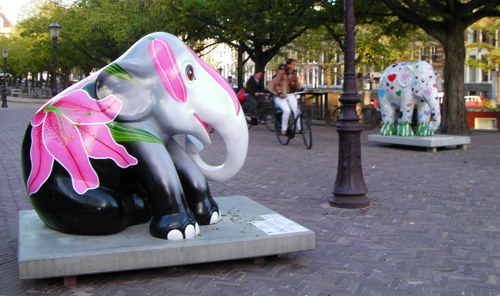
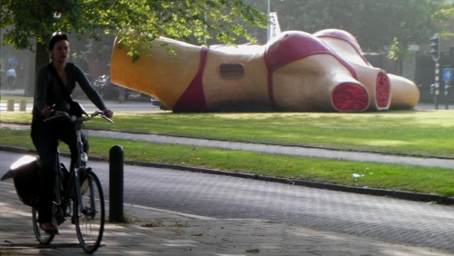

Cela faisait longtemps que je n'avais pas parlé d'expos en plein air, vous invitant à flâner dans Amsterdam si le temps le permet et à faire attention à des jolis trucs qu'on expose rien que pour vous dans la rue. C'est gratuit. Cette fois ci, point de photos mais deux expositions de sculptures de genres différents. Lisez plutôt:

<!--excerpt-->

## Elephant Parade
<!-- HTML -->

{.center}
Deux éléphants avec des vélos

<!-- / HTML -->

Commençons par la plus médiatique des deux, l'**Elephant Parade** (en anglais dans le texte), une exposition à ciel ouvert de statues d'éléphants décorés par des artistes. Les expositions monstres d'animaux décorés on commencé avec une parade de vaches à Zurich en Suisse et est devenue mondialement renommé lorsque cette même [cow parade](http://www.cowparade.com/) a été présenté il y a dix ans à Chicago pus New York. Dix ans plus tard, le concept continue de faire des émules et Amsterdam s'y met aussi avec [une parade éléphantesque](http://www.elephantparade.nl/). Une parade déjà présenté avec succès à Rotterdam et Anvers. Le prétexte n'est pas mercantile cette fois puisque la fondation organisatrice de l'évènement reversera les bénéfices à **The Elephant Family**, une association de protection des éléphants d'Asie. Les statues sont commissionnées par des entreprises qui affichent leur nom sur les stèles des statues, elles sont décorées par des artistes et des designers qui font parler d'eux et elles seront vendues aux enchères chez Christie's. C'est donc à un évènement de *charity business* que je vous invite aux quatre coins de la ville. En fait, il n'est pas possible de la rater. Les éléphants sont partout ils ont juste prévu de partir fin novembre.

## Art zuid
<!-- HTML -->

{.center}
Une fille-bar en bikini et une fille à vélo

<!-- / HTML -->

Art Zuid est une initiative d'abitants de mon arrondissement, ils ont décider d'occuper deux avenues près de chez moi avec des statues de différents artistes modernes. Les avenues sont grandes avec un large terre-plein boisé. Elles sont le résultat des [plans d'urbanisme de l'architecte Berlage](/l-ecole-d-amsterdam) et forment **un cadre idéal pour une exposition en plein air**. [Art Zuid](http://artzuid.nl/) regroupe des artistes très divers, des classiques (comme **Hildo Krop**, star locale ou **Auguste Rodin**, star parisienne), aux sculpteurs modernes comme **CasZuidas** avec son [Moving images in Public Space](http://www.caszuidas.nl/site/splash.php). Beaucoup de sculpteurs inconnus au programme pour moi, mais même s'il y en a qui se foutent de la gueule du monde comme on peut le faire en art moderne, je crois vraiment que cette expo vaut le détour. Vraiment, j'insiste, venez sur Apollolaan et Minervalaan, vous y découvrirez l'expo et aussi l'urbanisme de Berlage le temps du balade pas idiote.

## Photos ?

Derrière ça, j'ose à peine parler des expos photos précédentes. Allez, si, les voilà:

<!-- post notes:
elephant parade
http://www.flickr.com/groups/1185924@N20/pool/ 
artzuid
http://www.flickr.com/groups/1184315@N20/pool/
--->
