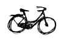

Pays des vélos, les Pays-Bas sont les premier producteurs et surement l'un des premiers exportateurs de bicyclettes du monde. Néanmoins les Pays-Bas importent aussi des bicyclettes d'autres pays, eux aussi réputés pour leurs vélos.

### Giant
{.right}
**Giant** est une très grande marque de qualité. La gamme est très étendue allant du [vélo d'enfant](/plein-de-velos#kindfiets) au [vélo de course](/plein-de-velos#omafiets) en passant par le [vélo de ville](/plein-de-velos#transportfiets) que les hollandais aiment bien. C'est pourtant une marque chinoise (ROC), la plupart des vélos sont fabriqués Taïwan. Selon le site du fabricant, Giant est le premier producteur de bicyclettes du monde avec 6 millions d'unités produites. Pour répondre à une pareille demande, la marque a installé une usine en Europe, à Lelystad, Flevoland[^1] (Pays-Bas). C'est peut être pour cela que la marque est devenue le fournisseur de la première équipe cycliste Néerlandaise **Rabobank**. Les néerlandais de la rue ont aussi adopté Giant, tant on croise des vélos de la marque chinoise sur les routes et trottoirs. Bien que les asiatiques soit réputés pour copier le savoir-faire des autres, Giant est une marque innovante qui semble vouloir avoir une gamme plus élargie que [Gazelle](/plein-de-velos-hollandais-3#Gazelle), le numéro un Hollandais.
----

### Kronan
{.right}
**Kronan** est une marque suédoise qui était le fournisseur de l'armée dans son pays. La marque a eu un renouveau il y a quelques années aux Pays-Bas avec une politique originale: proposer des vélos rustiques et solides à l'opposé de ce qui se faisait à l'époque, avec un choix infini de couleurs pour le coté *trendy*. Ça a très bien marché. Amsterdam regorge encore de ces bicyclettes qui colorent un peu les stalles à vélos. Parfois transformés en [transportfiets](/plein-de-velos#transportfiets) les vélos Kronan sont surtout reconnaissables à leur porte bagage rectangulaire et anguleux. Hélas ce vélo est en voie de disparition ici parce que la boite qui les importaient a fermée. L'histoire pathétique de cette fermeture est [racontée sur Kreukreuscopie](http://kreukreuscopie.blogspot.com/2009/08/velos-de-folles.html). Il reste que Kronan a lancé la mode des couleurs vives que les constructeurs Néerlandais comme [BSP](/plein-de-velos-hollandais-3#bsp) ou [de Fietsfabriek](/plein-de-velos-hollandais-3#fietsfabriek) en ont fait leur spécialité.
----

### Dahon
{.right}
Les [vélos pliants](/plein-de-velos#voufiets) sont populaires auprès des banlieusards qui prennent le train et ceux qui n'aiment pas faire trainer leur vélo dehors. **Dahon** est une marque californienne est c'est le premier fabricant mondial de vélos pliants. les vélos sont fabriqués à Taïwan et en République Tchèque. Malgré le coté pratique du vélo pliant qu'on peut emmener chez soi et ranger à coté des parapluie, il n'est pas rare de trouver de vieux Dahon dépliés avec les autres vélos, garés juste comme ça dans la rue.
----

### Brompton
{.right}
Tout comme Dahon, les vélos **Brompton** sont des vélos pliants. Brompton est une marque anglaise et c'est même le premier fabricant de bicyclettes outre-mer-du-nord. Les brompton ont une très bonne réputation, une sorte d'excellence britannique, et c'est surement pour cela que les néerlandais, qui aiment les vélos solides et confortables, choisissent le plus souvent Brompton quand il s'agit d'acquérir un vélo pliant neuf. Le prix est lui aussi confortable et c'est sûrement pour ça que l'on ne retrouve jamais de Brompton qui trainent dans la rue.
----

### Christiania bikes
{.right}
Puisque nous sommes dans les vélo spéciaux, voici une marque de [vélo-benne](/plein-de-velos#bakfiets) (*bakfiets*) bien connue aux Pays-Bas depuis des années. **Christiania bikes** est l'équivalent danois de bakfiets (la marque) ou baboe dans le même segment très en vogue des vélos-benne. Cela permet de rappeler ici que le Danemark est le pays du vélo en compétition constante avec les Pays-Bas. Il y a donc plusieurs marques danoises de renom mais seule la marque Christiania se croise régulièrement à Amsterdam. Le fait que ces vélos sortent du [quartier libertaire de Copenhague](http://www.christiania.org/) est peut-être ce qui en a fait un succès commercial.
----

### Les autres
Les marques de vélos connues comme **Gitane**, **Peugeot** en France, **Punch** en Autriche ou **Raleigh** au Royaume-Uni n'ont plus réellement que leur nom à vendre. Certains de leurs modèles sortent d'une même usine et il y a de fortes chances pour que cette usine soit batave (même s'il est difficile de vérifier). Il est assez courant de croiser des vélos estampillés avec ces marques dans les rues des villes néerlandaises mais peut-on encore parler de vélo importés ?

Il y a aussi d'autres grandes marques étrangères importées aux Pays-Bas, se gardant une niche de marché. Les vélos italiens **Bianchi** sont connus dans le monde de la course tandis que les vélos allemands **Riese und Müller**  se croisent chez les randonneurs de campagne. Je ne peux pas être exhaustif ici mais je pense qu'avec [plein de vélos hollandais](/plein-de-velos-hollandais-3) et **plein de vélos (pas) hollandais**, vous avez un large aperçu des bicyclettes que l'on peut croiser tous les jours au pays de la petite reine[^2].

<!-- HTML -->

<a href="/plein-de-velos-hollandais" title="tout savoir sur la bicyclette aux Pays-Bas">
<!-- / HTML -->
**Plein de vélos hollandais**  
{.center}  
1) Les avantages  
<!-- HTML -->
</a>

<!-- / HTML -->

<!-- HTML -->

<a href="/plein-de-velos" title="tout savoir sur la bicyclette aux Pays-Bas">
<!-- / HTML -->
**Plein de vélos hollandais**  
{.center}  
2) Les styles
<!-- HTML -->
</a>

<!-- / HTML -->

<!-- HTML -->

<a href="/plein-de-velos-hollandais-3" title="tout savoir sur la bicyclette aux Pays-Bas">
<!-- / HTML -->
**Plein de vélos hollandais**  
{.center}  
3) Les marques
<!-- HTML -->
</a>

<!-- / HTML -->

<!-- HTML -->

<a href="/plein-de-velos-pas-hollandais-4" title="tout savoir sur la bicyclette aux Pays-Bas">
<!-- / HTML -->
**Plein de vélos hollandais**  
{.center}  
4) Les marques étrangères
<!-- HTML -->
</a>

<!-- / HTML -->

<!-- HTML -->

<a href="/une-heure-sans-velo" title="tout savoir sur la bicyclette aux Pays-Bas">
<!-- / HTML -->
**Plein de vélos hollandais**  
{.center}  
5) Parking à vélos
<!-- HTML -->
</a>

<!-- / HTML -->

<!-- HTML -->

<a href="/les-velos-de-location" title="tout savoir sur la bicyclette aux Pays-Bas">
<!-- / HTML -->
**Plein de vélos hollandais**  
{.center}  
6) Vélos de location
<!-- HTML -->
</a>

<!-- / HTML -->

<!-- HTML -->

<!-- / HTML -->
---
[^1]: Voir [Les provinces des Pays-Bas](/les-provinces-des-pays-bas)
[^2]: Non, je ne parle pas de Beatrix.
<!-- post notes:
http://www.youtube.com/watch?v=hINIgXsSGN8
--->
