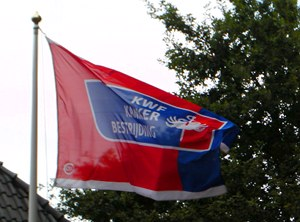

Un petit billet histoire de dire que je ne suis pas en retard pour vous donner des conseils de sorties. C'est ce week end qu'ont lieu les journées du patrimoine.

## Les journées du patrimoine
Comme en France à la fin septembre, les Pays-Bas insitent les gens à visiter les monuments historiques du pays. Ici, ça s'appelle *openmonumentendag* (la journée des monuments ouverts). Les [moulins privés d'Amsterdam](/les-moulins-d-amsterdam), par exemple tournent toute la journée et il est possible de les visiter. D'autres bêtiments historiques plus ou moins connus sont ouverts uniquement ce week en. Un site les référence tous: [openmonumentendag.nl](http://www.openmonumentendag.nl/).

## Le KWF Kankerbestrijding

{.right}
En faisant le tour des monuments, vous croiserez beaucoup de drapeaux bleu et rouge qui flotte au vent. On a vu que les néerlandais son [dingues de leur drapeau national](/le-prinsenvlag-aux-fenetres) et qu'ils le mettaient aux fenêtre [ou en berne](/dodenherdenking-le-jour-du-souvenir) quand le protocole l'exigeait mais nous avons ici un autre engouement. C'est le drapeau du **KWF Kankerbestrijding**, la ligue nationale contre le cancer (*kanker*). Car ce week-end c'est aussi la journée nationale de lutte contre le cancer aux Pays-Bas. C'est annoncé par les drapeaux mais aussi des affiches et des spots télé. En gros c'est ce week-end qu'est organisé la collecte nationale au profit de **KWF Kankerbestrijding**. Selon [leur site](http://www.kwfkankerbestrijding.nl/index.jsp), 120.000 personnes vont faire du porte à porte pour rapporter quelques 55 millions d'euros à la fondation. Tous ces sous seront utiliser pour financer la recherche et améliorer les soins et le cadre de vie des malades.
---
<!-- post notes:
!!Le KWF Kankerbestrijding
En faisant le tour des monuments, vous croiserez beaucoup de drapeaux bleu et rouge qui flotte au vent. On a vu que les néerlandais son dingues de leur drapeau national et qu'ils le mettaient aux fenêtre ou en berne quand le protocole l'exigeait mais nous avons ici un autre engouement. C'est le drapeau du __KWF Kankerbestrijding__, la ligue nationale contre le cancer (''kanker''). Car ce week-end c'est aussi la journée nationale de lutte contre le cancer aux Pays-Bas. C'est annoncé par les drapeaux mais aussi des affiches et des spots télé. En gros c'est ce week-end qu'est organisé la collecte nationale au profit de __KWF Kankerbestrijding__. Selon leur site, 120.000 personnes vont faire du porte à porte pour rapporter quelques 55 millions d'euros à la fondation. Tous ces sous seront utiliser pour financer la recherche et améliorer les soins et le cadre de vie des malades.
--->
