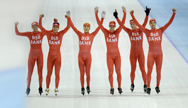

La **DSB Bank** est officiellement en faillite depuis plusieurs jours. Les derniers plans de sauvetage n'ont pas marché: la banque DSB pue trop. Cet été encore personne ne s'inquiétait pour cette banque. Que c'est-il donc passé?

<!--excerpt-->

**DSB Bank** est une banque qui a peu de succursales à Amsterdam. Je n'ai d'ailleurs [pas trouvé de distributeur](/choisir-une-banque) à cette marque quand je cherchais une banque. Par contre je voyais souvent à la télé des publicité pour des crédits faciles de sociétés filiales de cette banque DSB : **BECAM** et **Postkrediet** parmi les plus racoleurs[^1].

{.center}
*Chez DSB Bank, il n'y a que des gagnants*{.center}

DSB signifie **Dirk Scheringa Beheer**, du nom du charismatique *self made man*, ancien policier qui a créé l'établissement. **Dirk Scheringa** est surtout connu pour avoir racheté le club de football **AZ Alkmaar** qui a gagné le championnat des Pays-Bas l'année dernière. Mais il s'est aussi porté propriétaire de nombreux établissements de crédits à la consommation (*Becam*, *Frisia Financieringen*, *Lenen.nl* et *Postkrediet*) sous le nom de **DSB Groep**. 

En 2006, DSB obtient une licence d'établissement bancaire et devient **DSB Bank**. Le minstre des finances de l'époque est **Gerrit Zalm** (VVD). Plus tard en 2007, il quitte le [gouvernement Balkenende III](/balkenende-ii-est-tombe) et devient économiste en chef (*Hoofdeconoom*) puis directeur financier de la DSB. Poste qu'il quittera en 2008 pour  [ABN AMRO, fraichement rachetée par des requins](/les-deboires-de-la-royal-bank-of-scotland) avant d'avoir d'être nationalisée[^2].

DSB Bank ne fait pas parler d'elle pendant que le gouvernement débloque des milliards d'euros pour aider les grandes banques du pays (ABN AMRO, Fortis[^3], ING). Même si la clientèle cible de DSB Bank est la même que pour les *subprimes*, les offres de crédit du groupe sont encore plus alléchantes avec la baisse des taux et tout le monde est content.

Tout le monde? Non. Il semblerait que certains clients se plaignent de frais excessifs que la banque leur a décomptés avec leur crédit hypothécaire. L'association *Stichting Hypotheekleed* représente 7 de ces clients floués et le célèbre économiste **Pieter Lakeman** devient leur porte-parole en août. Ce dernier passe à l'émission matinale 
*Goedemorgen Nederland* le 1er octobre et [appelle tous les épargnants](http://goedemorgennederland.kro.nl/uitzending-fragment.aspx?id=229396 DSB moet faillite) à retirer en masse l?argent qu?ils ont placé dans la banque DSB afin de provoquer sa faillite. Ça peut paraître dingue mais l'appel est fortement suivit et les rumeurs de mauvaise santé de la banque n'arrange pas les choses. Tout le monde s'exprime sur la question.

La 12 Octobre, 40 millions d?euros retirés entre minuit et neuf heures et demie du matin. [Cela suffit suffi à convaincre le tribunal d'Amsterdam de placer DSB Bank sous curatelle](http://www.ambafrance-nl.org/france_paysbas/spip.php?article11374) . À partir de ce moment, **Dirk Scheringa** se démène pour trouver de l'aide accusant le monde entier de vouloir le couler. Il demande de l'aide de la part du gouvernement mais **Wouter Bos** (le ministre des finances remplacé Gerit Zalm et qui lui as plus tard offert un siège au conseil d'administration d'**ABN AMRO**) lui oppose une fin de non recevoir arguant que ce sont les pratiques de la DSB Bank qui sont la caus de sa perte[^4]. Dirk Scheringa a aussi fait la tournée des grandes banques néerlandaises, celles là même qui ont été sauvées par le gouvernement il y a quelque mois. Aucune d'entre elles n'acceptent de reprendre la DSB Bank et ses actifs pourris. Le 16 octobre le tribunal d'Amsterdam déclare la faillite de la banque. Un repreneur texan semble s'intéresser un temps à DSB mais finalement jette l'éponge. [Le 19 octobre](http://www.ambafrance-nl.org/france_paysbas/spip.php?article11388), la faillite de la banque est effective et tous les journaux en font leur une. Les gens qui n'ont pas retiré leurs sous n'ont plus d'espoir, l'état couvre les particuliers à hauteur de 100.000 euros en cas de faillite bancaire mais pas au plus.

Voilà ou nous en sommes aujourd'hui. Mais l'affaire ne devrait pas s'arrêter là, les personnalités que j'ai évoquées sont suffisamment médiatiques et le préjudice suffisamment important pour promettre des procès qui défrayent la chronique. On n'a pas fini d'en entendre parler, mais maintenant, vous ne pouvez pas dire que je ne vous ai pas aidé à comprendre.

---
[^1]: Les sites [BECAM](http://becam.nl/) et [Postkrediet](http://postkrediet.nl/) sont toujours en ligne, BECAM propose toujours des crédits consommation à 3%(*) de moins que les banques traditionnelles...
[^2]: Mais évidement, tout cela que n'a rien à voir avec les problèmes de la DSB Bank
[^3]: [La banque qui a ma vie entre ses mains](/j-appartiens-a-la-societe-fortis-anonyme).
[^4]: Ce qui n'a rien à voir avec  les grandes banques du pays dont les pratiques financières sont à l'origine (ou pas) de leurs difficultés .
<!-- post notes:
http://www.elsevier.nl/web/Artikel/168158/Vergunning-DSB-wil-bank-worden.htm 
http://www.youtube.com/watch?v=LLB8UreRVFY&feature=youtube_gdata
http://www.ambafrance-nl.org/france_paysbas/spip.php?article11320
http://goedemorgennederland.kro.nl/uitzending-fragment.aspx?id=229396 DSB moet faillite 

http://www.ambafrance-nl.org/france_paysbas/spip.php?article11383 
http://www.ambafrance-nl.org/france_paysbas/spip.php?article11377 < milliard et 100 millions
--->
