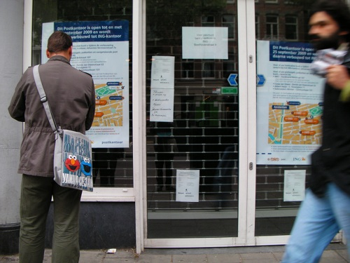
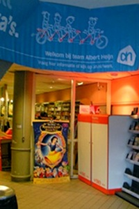
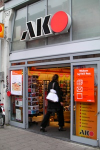

Annoncé en 2007 alors que la poste n'avait pas encore [pris les couleurs d'halloween](/la-poste-prends-les-couleurs-d-halloween), la fin des bureaux de poste  aux Pays-Bas devient de plus en plus certaine chaque jour. Le dernier épisode en date, la fermeture de mon bureau de quartier dans lequel il y avait pourtant des files d'attente tous les jours.

La dernière fois que j'y suis allé, pour récupérer un colis en instance, de grandes affiches annonçaient la fermeture définitive de cette agence. Déjà, les étagères de dépliants et articles en vente avait été remplacés par des cartons de déménagement et les distributeurs de billets avaient étés condamnés. Ce bureau de poste de *Centuurbaan* n'est pas le seul à avoir fermé. J'ai aussi constaté, les mois précédents, la fermeture des bureaux de *Kerkstraat* et de *Gerard Terborgstraat*.

{.center}

Les grandes affiches donnaient plus de précisions: Un plan du quartier, avec les différentes maisons de la presse et librairies, mises en exergue grâce à de gros logos [oranges TNT](/petits-vols-en-public). Les clients sont donc invités, à partir du 25 Septembre, à faire la queue dans les librairies et les maisons de la presse du coin pour acheter des timbres, envoyer ou retirer du courrier. Là ils pourront comme avant, être sollicités pour acheter du papier à lettre, des cartons à colis ou autres gadgets peu en rapport avec l'activité postale.

Les bureaux de poste (*postkantoor*)  étaient aussi un lieu pour effectuer des opérations bancaires pour les détenteurs de compte Postbank ([devenue depuis ING](/postbank-devient-ing-officielement)). Les affiches indiquent aussi l'agence bancaire ING la plus proche (hors du plan), incitant sans le dire les clients à utiliser les [services bancaires en ligne](/internetbankiren-experience).

Depuis la fermeture du bureau, je n'ai pas eu à retirer un coli en instance. Je ne sais donc pas ou le facteur va m'envoyer. Selon la carte sur les affiches, le nouveau bureau de poste le plus proche de cez moi est maintenant la supérette [Albert Hein](/albert-hein-et-compagnie). Cette supérette prend son nouveau rôle très au sérieux puisqu'à l'entrée du magasin, il y a maintenant deux grosses boîtes oranges pour déposer son courrier. Pour affranchir le courrier, les agents assermentés sont remplacés par des étudiants sous payés et tout le service devrait être le même; enfin, je n'ai pas envie de vérifier...

  

    
  TNT Post chez Albert Hein
  

  

  
  TNT Post dans une maison de la presse
  

## Et où sont passés les emplois ?

Lorsque l'annonce de fermeture des milliers de bureaux poste à travers le pays, la banque ING et la société TNT ont annoncés qu'il n'y aurait pas de suppression d'emploi. Je suppose qu'il était prévu de recaser les employés déplacés dans les agences bancaires ING et les bureaux de poste restant, comptant sur les départs à la retraite pour faire de la place. C'était en 2007 et à l'époque ces entreprises étaient optimistes et tout le monde les croyaient. 

Depuis, [il y a eu la crise](/les-deboires-de-la-royal-bank-of-scotland). ING a des problèmes et a reçu des aides de l'état. La banque a commencé à réduire ses effectifs en commençant par les consultants. Le gouvernement vient aussi d'annoncer le relèvement de l'age de la retraite dans quelques années. Tout ceci rend de plus en plus incertaine cette promesse de 2007.

Si quelqu'un en sait plus sur l'avenir et les emplois de ces postiers, anciens employés des bureaux de poste qui ont fermé, il peut laisser un commentaire ci-dessous.

Voir aussi : [Le nouveau nom de la poste aux Pays-Bas](/le-nouveau-nom-de-la-poste-aux-pays-bas)
