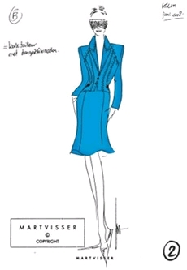

<!-- HTML -->

<!-- / HTML -->
{.left}
<!-- HTML -->
source: <a href="http://www.weloveshopping.nl/2009/04/mart-visser-ontwerpt-voor-klm/" style="color:#AAAAAA;">weloveshopping.nl</a>.

<!-- / HTML -->

## Nouveaux uniformes

Avec [le temps qu'il fait aux Pays-Bas](/c-est-la-fin-de-l-ete), porter un uniforme avec jupe est une contrainte pour les jambes frileuses. Même les stewardesses bataves, pourtant costaude et résistantes aux intempéries se plaignaient de ne pas pouvoir porter de pantalon. C'est maintenant possible. KLM, la compagnie nationale néerlandaise vient de lancer de nouveaux uniformes pour ses pilotes et personnels navigants. [Le Volkskrant nous apprend](http://www.volkskrant.nl/economie/article1297072.ece/Rok_of_broek_Dat_is_de_vraag_voor_stewardessen_KLM) que cela faisait depuis 1990 que les uniformes des hôtesses et personnels au sol étaient les mêmes

## Nouveaux pantalons

Les nouveaux uniformes des hôtesses KLM sont signées par [le couturier Mart Visser](http://www.martvisser.com/) qui avait déjà signé les nouveaux uniformes des hommes (steward, pilotes et personnels au sol) de la compagnie en 2000. La grosse innovation de cette nouvelle ligne est l'introduction du pantalon que les hôtesse pourront choisir à coté de deux modèles de jupes. Ce n'est donc pas la fin des jupes mais tout de même un grand changement. Le couturier en a profité pour enrichir la collection d'un pantalon femme pour les pilotes. On apprends dans le Volkskrant que les femmes pilotes devaient se contenter d'un pantalon pour homme qui était ensuite ajusté à leur mesure. Que de progrès en 2009!

## Pas de nouvelle couleur

La nouvelle couleur des uniformes pour les personnels de cabine et de bord reste le bleu-flashy-KLM, couleur introduite en 1971 que la compagnie utilise comme signature depuis lors. Il y a des choses qu'on ne change pas comme ça.
---