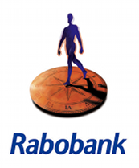

L'année dernière, je vous racontais comment [Postbank devenait ING](/postbank-devient-ing-officielement/). Ce que je ne vous ai pas raconté c'est qu'à la même période, j'ai chercher à ouvrir un compte dans une nouvelle banque[^1], à vocation moins hégémonique[^2], et ne pratique pas de [petits vols au quotidien](/petits-vols-en-public-2/) ni les placements exotiques que personne ne comprend. La tâche est ardue, on sait tous que ce qui intéresse une banque, c'est notre fric...

Voir aussi [Choisir une banque](/choisir-une-banque/), article de 2006.

## Rabobank c'est quoi?

<!--excerpt-->

J'ai fini par aller chez Rabobank. La banque dont les français n'entende parler qu'en été à l'occasion du tour de France. Rabo est la contraction de Raiffeisen et Boeren. Rabobank est en fait la réunion de la **Raiffeisen bank**, une banque coopérative, crée par [Friedrich Wilhelm Raiffeisen](http://www.alternatives-economiques.fr/raiffeisen--friedrich-wilhelm--1818-1888-_fr_art_223_31311.html) et très connue en Europe centrale et de la **Boerenleenbank**, l'équivalent de notre Crédit Agricole en France. Pour la petite histoire, les établissement de crédits du XIXème-XXème siècle s'appuyait sur un des [piliers de la société néerlandaise](/nouveau-mot-verzuiling), la Raiffeisen était protestante alors que la Boerenleenbank était catholique. Les deux établissements partageait les mêmes valeurs de proximité de mutualisme et de finance raisonnable. Elles se sont rapprochées naturellement jusqu'à fusionner en 1972, créant **Rabobank** en installant un nouveau siège à Amsterdam.

La banque **Rabobank Nederland** est toujours une société coopérative (*cooperatie*), est toujours la première banque du monde agricole et conserve ce même esprit de proximité en proposant uniquement des crédits, des placements non exotiques et quelques assurances. Elle s'est aussi rendue célèbre en devenant le sponsor de sports populaires aux Pays-Bas: [le vélo](http://drooderfiets.tumblr.com/post/135269601/rabobank) et le [hockey](/elles-ont-encore-gagne).

## Quel est ce logo bizarre?
{.right} Ce logo est apparu en 1994 [dessiné par Newell & Sorrell](https://logos.fandom.com/wiki/Newell_%26_Sorrell), remplaçant un logo dessiné par [Wim Crouwel](http://www.vividvormgeving.nl/vormgeverpagina/crouwel.htm), designer star de Total design. Ce logo a la qualité made in *Dutch design* mais il est quelque peu déconcertant, il n'a pas l'air de représenter une banque. Le message est pourtant clair: l'humain est au cœur de la stratégie du groupe. Pour être plus précis, on pourrait ajouter que le client est au cœur de la stratégie du groupe. Puisque cette banque est une coopérative, **elle n'a pas de compte à rendre à des actionnaires**. Point d'exigence de rentabilité maximum à court terme, 15% de rendement et autres conneries de ce genre. La stratégie table sur le long terme, une tradition agricole, elle semble se rapprocher de celle du [bon père de famille](http://www.vernimmen.net/html/glossaire/definition_bon_pere_de_famille.html), soucieux des intérêts de chacun. Cela peut parraitre bizarre pour une banque c'est peut-être pour cela que ce logo vous paraît bizarre lui aussi...

En période de crise financière comme cette année, ces choix deviennent censés. Le nouveau PDG de la banque, Piet Moerland [a annoncé en août 2009](http://www.ambafrance-nl.org/france_paysbas/spip.php?article11207) un bénéfice de 1,3 milliard d?euros alors que les autres banques du pays recevait des aides du gouvernement pour combler leurs déficits record. Biensur Rabobank n'est pas couverte contre tous les risques, ces résultats sont en baisse de 16% par rapport à 2008 et si [la crise économique continue](http://contreinfo.info/article.php3?id_article=2851), il est fort probable que cela continue d'affecter les résultats de la banque. Il reste qu'une banque qui se concentre sur le métier traditionnel de banquier et qui s'attache à le faire bien est plus rassurante qu'[une banque qui se la pête à faire n'importe quoi](/les-deboires-de-la-royal-bank-of-scotland).

J'ai donc quitté [Postbank](/postbank-amsterdam/) devenue ING[^3] et je suis allé chez Rabobank[^4]. Ceci n'est pas la solution miracle aux problèmes financiers de notre temps, mais j'espère que ça y contribue. Pour finir je vous propose de regarder la vidéo de recrutement de la banque pour la région d'Amsterdam. Point de photo de jeune battant souriants et près à tout pour augmenter leurs bonus, non, juste un film humoristique montant des amstelodamois et des gens serviables qui pourrait venir travailler chez Rabobank. Le service, c'est important. je me suis senti bienvenu en allant chez Rabobank alors j'espère que ça va durer.

---
[^1]: En fait je vous en ai un peu parlé: [Changement de banque](/changement-de-banque/) et ici [avec les vélos gratuits](/les-velos-gratuits/)
[^2]: Voir [j'appartiens à la société anonyme|]
[^3]: Officiellement parce que je n'aime pas le orange, c'est ce que j'ai mis sur le questionnaire.
[^4]: Officiellement parce que c'est une coopérative, c'est ce que j'ai mis sur le questionnaire.

<!-- post notes:
http://www.flickr.com/photos/faceme/2228395503/?addedcomment=1#comment72157622756528277 
http://users.ncrvnet.nl/hstol/rabobank1973.html 
https://www.rabobankamerica.com/about_us/rabobank_group.jsp 
///html
 
    

   
 

Deze tekst wordt vervangen door een videospeler indien u Flash geinstalleerd heeft.
      
         

  
///
--->
