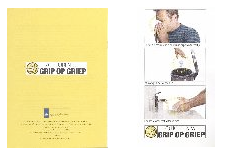

Ça y est, après avoir fait la une de l'actualité tout l'été, la grippe (cette année est est mexicaine) est bel et bien arrivée aux Pays-Bas. L'accalmie médiatique d'automne a été de courte durée. La grippe est arrivée et c'est à ce moment que je me suis souvenu de la campagne que le gouvernement a fait distribuer dans toutes les boîtes aux lettres du pays. Cette campagne s'appelle *Grip op Griep* (**tordons le cou à la grippe** ou un truc du genre). Elle explique les règles d'hygiène simples que tout le monde peut appliquer pour empêcher le virus de se propager.

<!-- HTML -->

 

<!-- / HTML -->
<!-- [recto](depliant-grippe-dos.jpg) | [verso](depliant-grippe-face-s.jpg) -->

Dès les premiers cas connus, la presse a pu enfin parler de la Grippe A aux Pays-Bas. Il ne s'agit pas pour le moment d'une grosse épidémie et il n'y a donc pas lieu de s'alarmer. Mais la presse et la télé font feu de tout bois alors la population s'est mis à téléphoner en masse aux services médicaux ce qui force aujourd'hui le gouvernement à commencer une nouvelle campagne.

<!-- HTML -->

[La presse Néerlandaise du 4 novembre 2009](http://www.ambafrance-nl.org/france_paysbas/spip.php?article11430) raconte  
"Il y aura une nouvelle campagne d'information sur la grippe A", annonce le **NRC Handelsblad** (pp.1 et 3) d'hier soir. "C'est ce qu'a décidé le ministère de la Santé publique, du Bien-être et du Sport (VWS) la semaine dernière, compte tenu du grand nombre de questions que les citoyens posent aux autorités et aux médecins généralistes. Lundi, Postbus 51, le guichet en ligne de la fonction publique, a enregistré un nombre record de questions sur la grippe lundi : 2 500, contre 250 en moyenne par jour il y a deux semaines."
"Cette offensive médiatique suit de peu le début de la vaccination, qui a commencé lundi" (également **De Telegraaf** p.3).

<!-- / HTML -->

Tout cela pourrait être très bien si, comme toujours, ce n'était l'émotion qui est à l'origine de toutes ces actions qu'on pourrait croire raisonnée. Le jeudi 29 octobre, une fillette est morte de la grippe A ce qui porte à 11 le nombre de victimes du virus H1N1 aux Pays-Bas. Le même jour, l'institut national de la santé publique et de l'environnement (RIVM) précisait qu'il ne s'agit pour le moment que d'une *épidémie légèr*. Le nombre de contaminations signalées aux médecins généralistes restant *relativement stable*.

<!-- HTML -->

[La presse Néerlandaise du 5 novembre 2009](http://www.ambafrance-nl.org/france_paysbas/spip.php?article11437#Grippe-A)  
Un virus de la grippe A résistant a été découvert aux Pays-Bas cette semaine. Son porteur ne réagit pas à l'inhibiteur Tamiflu. C'est le quarantième cas connu à l'échelle mondiale selon l'OMC.
Le patient a une déficience immunitaire (**de Volkskrant** p.3, **De Telegraaf** p.3, **Trouw** p.5).

L'AD, à la une, note que selon l'association des médecins généralistes néerlandais NHG, les médecins de famille commandent davantage de vaccin contre la grippe saisonnière et qu'à certains endroits les gens font la queue pour se faire vacciner. Mais ce vaccin ne protège absolument pas contre le nouveau virus H1N1, souligne le quotidien à grand tirage. "En ce moment 95 % des cas de grippe sont dus au virus qui provoque la grippe A."

<!-- / HTML -->
Toute cette prévention serait fort utile si elle n'était pas faite en dépit du bon sens. C'est peut être là qu'il y a lieu de s'inquiéter...

<!-- post notes:
http://www.nu.nl/buitenland/2116377/amerikaanse-kat-heeft-mexicaanse-griep.html
--->
