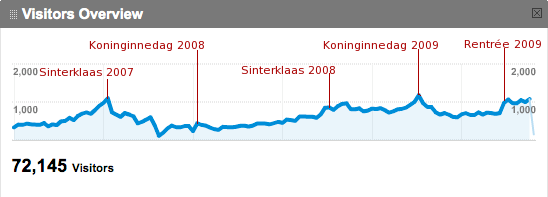

Aux Etats-Unis, le **Black Friday** est le vendredi après [Thanksgiving](http://fr.wikipedia.org/wiki/Action_de_Gr%C3%A2ce_%28Thanksgiving%29), le jeudi de l'action de grâce. *Black Friday* (**vendredi noir**) est un jour ou les magasins de détail font le plein de clients et réalisent un pic de ventes marquant le début de la saison des courses de Noël. L'expression *Black Friday* vient du fait que les comptes des magasins passent au noir (les pertes étant marquées en rouge).

Le lundi suivant est connu sous le nom du **Cyber Monday** parce que de plus en plus les gens font les courses en ligne le lundi, pour peut-être, essayer de trouver un meilleur prix de ce qu'ils on vu en ville le week end. Chris Silver Smith explique d'ailleurs qu'[il y a plusieurs Cyber Mondays](http://searchengineland.com/forget-black-friday-are-you-ready-for-holiday-seasons-cyber-mondays-12730) grace à de jolis graphiques. Cette analyse de statistiques me rappelle que le blog que vous lisez est aussi quelque peu saisonnier. J'ai peu l'habitude de parler du fonctionnement de ce blog mais je vais le faire ici en vous montrant quelques statistiques sur ses visiteurs.

{.center}

On constate que les visiteurs sont plus nombreux à l'approche de [la Saint Nicolas](/saint-nicolas-est-revenu-sinterklaas-is-terug/) et pour la [fête de la reine](/tag/koninginnedag/). 

Les quelques articles que j'ai écrit sur le sujet depuis 2006 apportent des réponses aux questions que les internautes se posent (via Google) à ces moments de l'année. On peut voir que depuis fin 2008, [Noël](/tag/noel/) et le [jour de l'an à Amsterdam](/liens-pour-nouvel-an/) augmentent aussi l'intéret de ce blog. Les requètes des internautes à cette période confirment tout cela. 

Les autres articles saisonniers comme [le bloemencorso](/bloemen-corso/) ou [Dodenherdenking](/dodenherdenking-le-jour-du-souvenir/) ne drainent que très peu de visiteurs suplémentaires mais je retrouve parfois leurs requètes dans les logs. Seule inconnue que je n'ai pas eu le temps de vérifier, la soudaine augmentation de fréquentation en septembre 2009. Ce sera pour la prochaine fois...

<!-- post notes:
http://www.shopwiki.co.uk/wiki/Black+Friday+and+Cyber+Monday
--->
