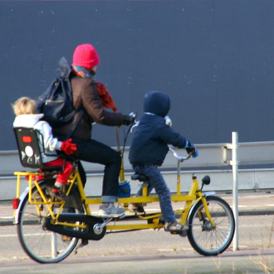
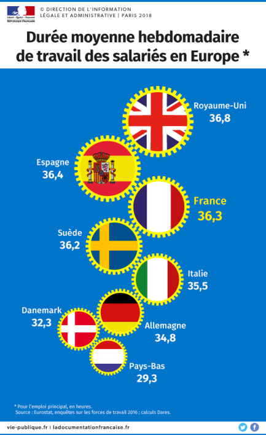

Une conversation de restau m'a rappelé une particularité néerlandaise que j'aimerais partager ici aujourd'hui: **la famille**. Je espère ainsi apporter quelques éclaircissement pour ceux qui ont parfois du mal à comprendre ces autres mangeurs de fromages... 

Le mot famille se traduit de deux façons en néerlandais: *familie* et *gezin*. Les traducteurs en ligne traduisent correctement ces deux mots en ne faisant aucune différence pourtant, il y en a une qui est très important pour tout hollandais.

* **[ge·zin](http://www.vandale.nl/vandale/opzoeken/woordenboek/?zoekwoord=gezin)** *het; o -nen; -netje* ouders en kinderen: *een gebroken ~* waarvan de ouders gescheiden zijn

* **[fa·mi·lie](http://www.vandale.nl/vandale/opzoeken/woordenboek/?zoekwoord=familie)** *de; v -s* 1 iems gezamenlijke bloedverwanten 2 groep aan elkaar verwante personen met dezelfde naam 3 gezin 4 (*biol*) onderdeel ve orde die bestaat uit een of meer geslachten

[{.center}](https://www.flickr.com/photos/13274211@N00/3277477796/)

*Gezin* désigne donc les parents et les enfants (la cellule familiale) tandis que le sens premier du mot *familie* désigne les personnes du même sang, la famille au sens large, famille biologique ou personnes portant le même nom. Parfois le mot *gezin* inclus les animaux domestiques de la maisonnée comme le montrent [certaines images de cette recherche](http://www.ethicle.com/nl/search.php?q=gezin&type=images). *Gezin* possède même son diminutif officiellement entré au dictionnaire *gezinetje* ce qui montre l'attachement des néerlandais pour ce mot et surtout pour la cellule familiale de base.

**La cellule familiale est donc importante dans la culture néerlandaise**. C'est vraisemblablement une conséquence de la culture protestante, dominante pendant des siècles, mettant en avant la présence de Dieux dans les événements les plus marquants d'une famille. C'est peut-être aussi une conséquence du [climat peu clément](/la-temperature-ressentie) incitant les gens à cocooner et donc renforcer les liens familiaux proches. La cellule familiale de base est au centre de la vie des néerlandais. Ceci explique bon nombre de relation sociales qui peuvent sembler curieuses pour un étranger.

Les néerlandais paraissent froids à tous ceux qui s'en approchent, long à briser la glace il ont des relations amicales très exclusives ce qui les rends absents en dehors des relations sociales convenues. cette exclusivité est cultivée au sein de la famille dès le plus jeune age. La plupart des néerlandais que je connais ont quelques amis datant de leurs années d'université (la période où ils quittent la cellule familiale). Habitués à un lien fort, ils sont peu enclins à rencontrer de nouvelles personnes mais sont très fidèles en amitié.

Le shémas classique des relations néerlandaises est celui de la famille (gezin) jusqu'à l'adolescence. Puis le jeune batave s'en va à l'université où il s'intègre grâce aux fraternités (et aux sororités pour les filles). Ces amitiés de fac resteront souvent pour la vie malgré les aléas de la vie professionnelle.

Le monde du travail n'est pas au dessus du monde de la *gezin*. Les néerlandais partent du boulot plus tôt que les français et prennent congé dès que la santé de leur enfant l'exige. La famille passe avant le travail. Les employeurs le savent bien et c'est sans doute pour cela qu'à l'issue de chacun de mes entretiens d'embauche, je me suis vu demander si je voulais travailler à temps plein ou à temps partiel. Le temps partiel est très développé aux Pays-Bas[^1] et les enfants en sont souvent la cause.

{.center}
*Durée de travail hebdomadaire en Europe*

### Le point de vue du philosophe

**Emmanuel Todd** nous a expliqué que le modèle de la famille nucléaire est aussi un modèle libéral (lire [la troisième planète](https://fr.wikipedia.org/wiki/La_Troisi%C3%A8me_Plan%C3%A8te)). Les relation parents-enfants sont basées sur la liberté et ce modèle très présent dans le monde anglo-saxon est ce qui explique le libéralisme de ces sociétés. Ce libéralisme néerlandais est [souvent expliqué par le calvinisme](/catholiques-et-protestants) qui, même si les Pays-Bas ne sont plus un pays religieux, marque encore la société néerlandaise. Les deux raisons ne sont pas contradictoires. La famille nucléaire tous comme le calvinisme n'aiment pas les structures hiérarchiques et préfèrent l'individualisme et la liberté.

---
[^1]: voir le graphique d'Eurostat montrant les Pays-Bas, pays ou l'on travaille le moins (Merci Laurent).
<!-- post notes:
http://ic.pressflex.com/249.pressflex.net/images//2570.photo.jpg
>> http://storhy.com/temps-travail-europe/
--->
