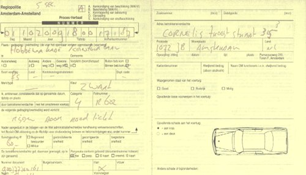
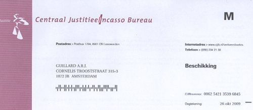

Parmi les [marronniers de la saison](/c-est-la-fin-de-l-ete) il y a les lumières pour vélos. Je vous ai parlé de cette [obligation d'avoir des lumières sur son vélo](/lumieres-hiver) puis des différentes manières, plus ou moins pratiques de [fixer ses lumières](/les-nouvelles-lampes-de-la-nuit), et mêmes des [lampes spéciales](/les-lampes-velo-hema). Je n'ai pas assez insisté sur le volet répression.

Parce que quand les jours raccourcissent et que la lumière baisse, les flics sont vraiment de sortie. Ils sont là pour inciter les vélos à mettre leurs loupiottes (prévention) et pour cela, ils verbalisent tous ceux qui n'en ont pas (répression). Je ne sais pas si c'est cette année ou pas mais les flics qui étaient de sortie étaient tous mobilisés pour mettre des PV au moindre contrevenant. On aurait dit qu'il y avait un concours de PV, celui qui en mettait le plus devait gagner un voyage à Curaçao. Ici un motard qui verbalise un vélo qui pédale sur le trottoir (c'est interdit et ça coûte 35 euros), là un groupe de constables piétons en embuscade derrière un feu rouge, arrêtant tout ce qui grille.

## J'ai grillé le feu

J'ai aussi perdu à ce jeu là, grillant l'un de mes feux rouges quotidiens (ici tout le monde grille les feux à vélo). **J'ai été rejoint par un motard jaune fluo** qui a essayé de me sermonner pour me dire que ce carrefour était dangereux et qu'il ne faut pas griller les feux rouges « ya encore eu des morts récemment ». J'ai donné tous mes détails, nom, adresse, nationalité et tout ça. **Il n'a même pas demandé mes papiers et m'a donné le PV** en me disant que j'allais bientôt recevoir une lettre.

{.center}

Ce qui est rigolo c'est que j'aurais pu mentir en donnant une fausse adresse, tout comme lui qui affirme qu'il y a eu des morts sur ce carrefour et qui n'est pas foutu de savoir que j'habite la rue juste derrière. Mais enfin, il m'a fait confiance et je lui ai rendu tandis que lui m'a menti et je ne l'ai pas cru. J'ai juste évité de lui dire, impressionné par son uniforme jaune fluo tandis que les passants me regardaient avec une mine compatissante. 

## J'ai payé la contravention

Là ou la con stable n'a pas menti, c'est sur sa promesse de commandement de payer. J'ai reçu la facture quelque temps après et j'ai donc du faire [un virement](/les-virements-et-les-cheques) au service d'encaissement des amendes du ministère de la justice. Ma première aventure avec [drooderfiets](https://pixelfed.social/drooderfiets), [mon nouveau vélo](/drooderfiets-mon-nouveau-velo): J'ai grillé, j'ai perdu.

{.center}
---