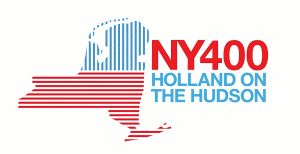

C'est le 11 septembre 1609 que le navigateur [Henry Hudson](http://fr.wikipedia.org/wiki/Henry_Hudson) aborda l'île de Manathan avant de remonter la rivière qui porte maintenant son nom. L'explorateur anglais navigant pour le compte de **la Compagnie néerlandaise des Indes orientales**, permis aux États Généraux des Provinces Unies de revendiquer les Nouveaux Pays-Bas (ou Nouvelle-Belgique) et d'y fonder des villes de comptoirs dont la Nouvelle Amsterdam.

La suite de l'histoire est connue, après avoir exploité et colonisé les Nouveaux-Pays-Bas (ou Nouvelle-Belgique) , les Provinces-Unies cèdent place aux anglais, Pieter Stuyvesant prends la **Nouvelle Amsterdam** qu'il rebaptise **New York** en septembre 1664. 

{.left}
La ville de New York se souvient de ce passé. Cette année elle fête ses 400 ans en se remémorant ses origines néerlandaises. De nombreux évènements conjoints ont été organisés de part et d'autre de l'Atlantique. L'état de New York en enier se souvient qu'il fut un temps Pays-Bas comme le montre le logo qui mélange la carte de l'état et du royaume. Les hollandais ont envoyé se qu'ils font de mieux. La société [Batavus](/plein-de-velos-hollandais-3#batavus) a offert 400 vélos hollandais oranges à la ville de New-York qui s'est chargé de convertir ses habitants à la bicyclette. Manathan a aussi acceuilli [un pavillon du Dutch Design](http://www.metropolismag.com/story/20090415/dutch-treat), activité réputé dans le monde entier. Le mois de novembre était consacré à la culture héritée des néerlandais (*Dutch Heritage Days*) autour de quartiers au noms bataves comme Harlem (*Haarlem*), Brooklyn (*Breukeleun*) ou Flushing (*Vlissingen*). À cette occasion, la famille royale a fait une visite d'état dans la ville et le couple princier, héritier du trone des Pays-Bas, s'est joint à [la fête sur Governor's Island](http://www.ny400.org/lifestyle/on-governors-island).

Plusieurs sites web se sont montés pour l'occasion, [ny400.org](http://www.ny400.org/) est le site officiel, en anglais avec tout le détail des festivités. Le site [ny400.nl](http://www.ny400.nl/) reprend le même thème mais explique tout ça aux néerlandophones en mettant en avant la tripotée de sponsors néerlandais, partenaires affichés de l'évènement. Il y a aussi le site [Henry Hudson 400](http://www.henryhudson400.com/home.php) qui apporte la justification de cet anniversaire alors que les premiers colons sont arrivés à Manathan des années plus tard. Enfin, Le site [5 Dutch Days 5 Boroughs](http://www.5dutchdaysnyc.org/home.html) présente les journées annuelles de la culture Néerlandaise dans la grosse pomme.

Je ne peux pas m'empêcher de présenter aussi le site sur [les origines de New York](http://users.skynet.be/newyorkfoundation/FR.html) qui raconte que **de nombreux francophones sont aussi impliqué dans la fondation et l'histoire de la plus peuplée des villes anglophones**.

<!-- post notes:
http://www.exploreny400.com/Home.aspx
--->
