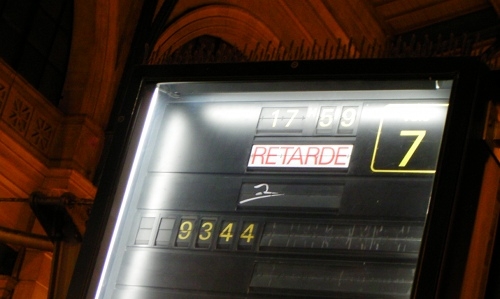

Annoncé depuis des lustres, [souvent reportée](/une-nouvelle-ligne-a-grande-vitesse), la nouvelle ligne de trains à grande vitesse des Pays-Bas est enfin en service depuis le 13 décembre 2009. J'ai déjà effectué un trajet sur cette ligne mais la multiplication des incidents m'ayant fait arriver avec plus 3 heures de retard et le ventre vide n'était pas propice à la rédaction d'un billet objectif. Je refais le trajet aujourd'hui en vous écrivant depuis mon siège de passager, preuve que le service de wifi à bord fonctionne. On m'annonce déjà 55 minutes de retard. Le nouveau Thalys à grande vitesse est toujours en retard, la faute aux néerlandais.

## La nouvelle ligne
La nouvelle ligne a fait couler beaucoup d'encre dans les journaux. Comme beaucoup de grands travaux entrepris dernièrement dans le pays, sa réalisation a duré beaucoup plus longtemps et a coûté beaucoup plus cher que prévu. Les derniers déboires concernaient la fourniture de la locomotive ([voir billet sur le sujet](/une-nouvelle-ligne-a-grande-vitesse)) et les tests de sécurité qui ont pris beaucoup de retard. La nouvelle ligne a finalement été ouverte et l'on peut découvrir des ouvrages d'art impressionnant comme ce tunnel de presque 8km sous les polders du *Groene Hart*, le c?ur vert de [la Randstad](/le-randstad), construit pour préserver l'environnement.

La nouvelle ligne ne passe plus par La Haye ([au grand dam d'Angie qui en parle sur le forum](http://leforum.nl/index.php/component/content/article/38-evenements/153-13-decembre-2009-thalys)). Le trajet Amsterdam-Paris dure ainsi presque 50 minutes de moins qu'avant. Sa durée passe sous la barre psychologique des 4 heures. Avec un trajet de 3 heures et quart environ, le Thalys devient une alternative sérieuse à la voiture ou l'avion. La société Thalys, consciente de ce nouvel attrait en a profité pour augmenter les prix des billets.

## Des débuts chaotiques
{.left}
D'après les conversations que j'ai eu avec le personnel de bord, le Thalys est déjà arrivé à l'heure mais c'est très rare, des problèmes de signalisation et de sécurité sont rencontrés en cours du trajet et les rames doivent s'arrêter en pleine voie. De plus, la neige oblige les rames à ralentir. On m'a raconté que à pleine vitesse, la glace présente sur les voies risquaient d'endommager les rames. Le gnon sur la vitre à ma droite semble confirmer ce risque...

Ce qui est étrange c'est que sur le tronçon après Bruxelles, le trajet s'effectue à pleine vitesse quelque soit la météo. C'est presque toujours dans la partie néerlandaise du voyage que les trains prennent du retard. Il semblerait bien que la nouvelle ligne à grande vitesse ne soit pas encore au point. Je ne sais pas comment ça se passe mais la SNCF et la NS qui doivent rembourser une partie du billet en cas de retard de plus d'une heure devrait se retourner contre la HSA, société responsable de la nouvelle ligne.

## Continuité dans la médiocrité
À part ces changements qui ne sont pas encore des amélioration, le Thalys entre Amsterdam et Paris est toujours aussi peu agréable. Les rames utilisées sont [des vieilles PBA](http://en.wikipedia.org/wiki/SNCF_TGV_Thalys_PBA) qui ont plus de quinze ans. L'aménagement intérieur a parfois été rafraichit mais pas toujours on découvre parfois des logo SNCF des années 80 dans les toilettes, des bouts de moquettes décollés ou des porte-documents abimés, même en première classe. Le personnel de bord reste très aimable et serviable et la première classe propose toujours deux collations durant le voyage. Très appréciable.  

Enfin, le site voyage-sncf pour réserver ses billets est toujours aussi lourd et mal conçu, il n'y a toujours pas la possibilité de regarder les horaires sur le jour suivant. Hélas, le site Hi-Speed, que la NS a mis en place pour réserver les billets de train à grande vitesse, semble s'être inspiré de celui de la SNCF. J'attends toujours la possibilité d'acheter mes billets de Thalys depuis l'excellent site [Die Bahn](http://www.deutschebahn.com/site/bahn/fr/start.html)...
