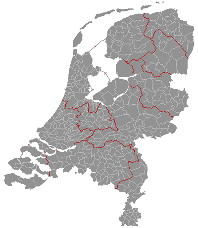

Les sujets du nouvel an sont pléthore, il me suffit de piocher dedans pour vous écrire un joli marronnier d'hiver[^1]. Je pourrais aussi vous reparler des [feux d'artifices du nouvel an](/les-bruits-du-nouvel-an), [des dégâts qu'ils causent](/il-y-a-eu-des-degats) et vous afficher des bonnes résolutions[^2]. En vrac, je peux vous parler de l'augmentation des prix pour l'électricité et le train, de la neige et du gel qui promet des [week-end patinage](/les-canaux-gelent) cette année encore. J'ai décidé de vous parler du **regroupement de communes**.

Le regroupement de communes, *Gemeentelijke herindeling* est très courant aux Pays-Bas. Il s'agit parfois d'absorption d'une petite commune par une plus grosse, l'ancienne commune devenant un quartier ou un arrondissement. Le plus souvent il s'agit d'une fusion, le regroupement de plusieurs communes en créent une nouvelle avec un nom sorti du chapeau. Tous les ans il y a plusieurs 'Gemeentelijke herindeling''  et en ce premier janvier 2010, le nombre de communes des Pays-Bas est passé de 441 à 431.

## Le contexte

Ceci donne une moyenne de 38.620 habitants par communes alors que la France et ses 36.682 communes a une moyenne de 1.770 habitants par commune. **La France est un cas particulier en Europe**. Aucune loi incite au regroupement des communes. Au Pays-Bas, la décentralisation introduite dans les années 80 s'est accompagnée d'une forte incitation au regroupement des communes pour que le plus petit échelon administratif de la société ait les moyens de répondre aux nouvelles prérogatives qu'on lui confiait[^3]. 

## La méthode
Les gouvernements successif se sont donné des objectifs de population. Dans les années 70, une commune devait comporter 5.000 habitants et dans les années 90, on estimait que ce chiffre devait être de 25.000 habitants. Les régions les plus rurales (Frise, Groningue, Drenthe, Zélande) ont été les premières concernées et l'on voit sur [la carte actuelle (au 01-01-2010)](http://img.photobucket.com/albums/v231/ylivieska/ebt/NL431.png) que ces provinces ont les communes les plus grandes (si l'on exclue le [Flevoland](/les-provinces-des-pays-bas#flevoland), province-polder créée en 1986 avec juste 6 communes parmi les plus grandes du pays). Les regroupement se concentrent généralement dans une région. Au début, les municipalités concernées étaient juste consultés mais les résistances locales due à la perte de pouvoir se sont fait plus nombreuses. En 2002, le premier gouvernement Balkenende (avec la populiste LPF de Pim Fortuyn) a décidé de ne plus imposer les regroupement d'en haut. Les municipalités ont maintenant à donner leur accord et certains regroupement sont ainsi annulés ou reportés. Dans les fait il y a toujours des moyens de pression pour contraindre une municipalité récalcitrante. Cette année, les regroupement ont eu lieu en Limbourg mais trois communes se sont regroupées en province de Groningue parce que le gouvernement provincial à mis du temps à convaincre la municipalité de Reiderland.

## Les regroupements de 2010
{.right}

Voici la liste des fusions de communes qui ont eu lieu le **1er janvier 2010**. J'espère que vous apprécierez l'exotimze volontaire des nouveaux noms.

* Les communes de **Reiderland**, **Scheemda** en **Winschoten** à l'est de la **province de Groningue** se sont regroupées pour former [Oldambt](http://fr.wikipedia.org/wiki/Oldambt). -2

* En Province de **Hollande Méridionale** les communes de **Moordrecht**, **Nieuwerkerk aan den IJssel** en **Zevenhuizen-Moerkapelle** ont décidé ensemble de fusionner pour former [Zuidplas](http://fr.wikipedia.org/wiki/Zuidplas). -2

* En **Limbourg**, la commune de [Venray](http://fr.wikipedia.org/wiki/Venray) a absorbé les villages de **Blitterswijck**, **Geijsteren** et **Wanssum** qui faisaient avant partie de la commune de **Meerlo-Wanssum** démantelée -1

* Les territoires restant de la commune de **Meerlo-Wanssum** (les villages de **Swolgen** et **Tienray**) ont été absorbés par [Horst aan de Maas](http://fr.wikipedia.org/wiki/Horst_aan_de_Maas) qui a aussi absorbé la petite commune de **Sevenum**. -1

* Toujours en **Limbourg** les communes de **Helden**, **Maasbree**, **Meijel** et **Kessel** se sont réunies pour former la commune de [Peel en Maas](http://fr.wikipedia.org/wiki/Peel_en_Maas). -3

* Dans la même région, la ville de [Venlo](http://fr.wikipedia.org/wiki/Venlo) sur la frontière allemande a absorbé la petite commune de **Arcen en Velden**. -1

2010 vient de commencer et il est déjà prévu une autre fusion de communes pour le **18 mars 2010**:

* En **Hollande Méridionale**, [Rotterdam](http://fr.wikipedia.org/wiki/Rotterdam) absorbera la commune de **Rozenburg**, la plus petite commune des Pays-Bas qui jouxte la nouvelle extension du port de Rotterdam. -1

## Ce n'est pas fini

* En 2011, [les Pays-Bas perdent 3% de leurs communes](/les-pays-bas-perdent-de-leurs-communes) Les regroupements les plus impressionnants sont en Frise et en Utrecht.
* Les [fusions de communes se poursuivent](/fusions-communes-se-poursuivent) ( -3 en 2012, -7 en 2013, -5 en 2014 et -10 en 2015 ! )

---
[^1]: Mais les marronniers sont plus jolis [en automne](/les-marronniers-de-l-automne)...
[^2]: Une revue des bonnes résolutions des années passées [2009](/les-bonnes-resolutions) et [2008](/pour-les-voeux-c-est-fini) m'ont convaincu qu'il vaudrait mieux ne rien promettre
[^3]: Ce point fait débat aujourd'hui en France tout comme il a du faire débat aux Pays-Bas dans les années 70-80. Cela peut sembler surprenant qu'une loi censée apporter plus de pouvoir à l'échelon local (décentralisation) soit la cause d'une dissolution du pouvoir local (regroupements)