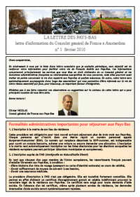

Le Consul général de France aux Pays-Bas m'a écrit personnellement hier. Il m'a envoyé un avec un mail avec sa véritable adresse de diplomate et m'a envoyé la nouvelle **lettre d'information du Consulat général de France à Amsterdam**. Ce n'était donc pas un courrier personnel mais surement un mail envoyé à tous les [français inscrits au consulat](/carte-inutile). Je me souviens avoir donné mon adresse lors de mon inscription.

<!--excerpt-->

Monsieur Olivier Nicolas a pris ses fonctions [en septembre 2008](/renouvellement-diplomatique) et j'ai déjà pu le voir à quelques reprises mouiller sa chemise pour animer quelques soirées organisés par des Français des Pays-Bas. Cette lettre d'info est une bonne idée qu'on peut j'en suis sur mettre à son crédit. En plus d'être envoyée par mail, cette lettre est disponible [sur le site du consulat](http://www.consulfrance-amsterdam.org/article.php3?id_article=615).
[{.right}](/files/2010/201002-lettre-consulat1.pdf)
Dans son éditorial, le consul annonce que cette lettre sera périodique mais ne donne pas de périodicité. Le contenu étant majoritairement des renseignements utiles, j'espère que de nouvelles lettres sortiront quand les informations ne seront plus valables. Au sommaire de ce numéro, un rappel sur les formalités administratives aux Pays-Bas ([j'en parle ici](/mes-premiers-pas-comme-immigre)) et aussi des renseignements sur les permanences consulaires, les élections régionales en France (les français de l'étranger peuvent voter[^1]), les frais de scolarité ([j'en parle ici](/frais-de-scolarite-les-eleves-francais-a-l-etranger)) la convention de Strasbourg qui régit les doubles nationalités en France et laisse la place au [conseiller des français élu pour les Pays-Bas](/resultat-des-elections).

  <!--Gone http://www.consulfrance-amsterdam.org/IMG/pdf/lettre1.pdf) -->

Plein de renseignements utiles et peu de blabla, la lettre vient volontairement avec une «page des associations» grace à laquelle les français auront tout loisir de blablater avec des compatriotes de manière plus constructive tant pour leur vie sociale que pour leur intégration.

Bonne lecture,

---
[^1]: Et j'aimerais bien revenir là dessus avant les régionales