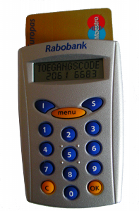
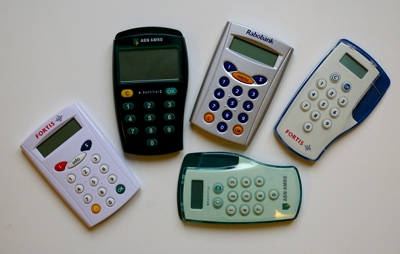

**Gérer son compte sur internet** est intéressant parce que c'est pratique pour les usagers et moins coûteux pour les banques qui limitent ainsi les opérations de caisse. Ce peut être aussi juteux pour les escrocs qui utilisent des systèmes toujours plus ingénieux pour récupérer les données des usagers, leur mot de passe et en fin de compte leur argent. Les banques doivent protéger leurs clients et offrir un des services hautement sécurisés. Encore une fois les Pays-Bas font différemment de la France. Voyons donc en quoi le système néerlandais est supérieur.

<!--excerpt-->

## En France

En France, la plupart des sites de gestion bancaire n'offrent pas l'ensemble des services bancaires pour des raisons de sécurité. La plupart des sites proposent aux clients de se connecter avec un couple numéro de compte/mot de passe. Le gros de la sécurité repose sur l'utilisateur et ce qu'il fait de son mot de passe (comme souvent). Ne pas noter ou divulguer son code est quelque chose d'évident que les banques rappellent régulièrement à leurs clients. Les clients peuvent respecter cette recommandation (ou pas). 

L'autre danger est l'ordinateur du client. Il n'est pas toujours à l'abri de virus ou chevaux de Troie capables de récupérer les mots de passe tapés par l'utilisateur. Les banques essayent de s'en prémunir en mettant en place des systèmes d'accès n'utilisant pas le clavier, façon digicode pour la Banque Postale ou sudoku pour le Crédit Agricole. Ce système n'est pas à l'abri de systèmes d'espionnage perfectionnés capable de reproduire à distance ce qui est affiché à l'écran.

Conscient des vulnérabilité du système, les banques françaises limitent les services offerts en ligne de sorte qu'il soit impossible de vider d'un coup le contenu d'un compte. C'est encore la meilleur protection.

## Aux Pays-Bas
{.left}
L'approche néerlandaise est différente. Les clients sont habitués à faire [des virements](/les-virements-et-les-cheques) électroniques à quiconque avec leur carte et veulent pouvoir le faire aussi en ligne. Il n'est donc **pas question de limiter les services offert en ligne**, les banques des Pays-Bas ont donc décidé de limiter la durée de vie des mots de passe. Si ce dernier est volé, ce n'est pas bien grave puisqu'il ne peut pas resservir. Pour pouvoir donner les mots de passe différent à chaque session, les banques mettent à disposition de leurs clients un petit appareil capable de lire et valider leur carte bancaire ([La Rabobank](/changement-de-banque-rabobank) l'appelle le [random reader](http://nl.wikipedia.org/wiki/Random_Reader)). 

Le fonctionnement du système est simple : Le site vous demande de vous connecter en entrant votre numéro de compte, le lecteur de carte lis votre carte bancaire et vous demande votre pin (le code secret de la carte). En retour il donne un numéro à huit chiffre qui est unique et calculé en fonction du numéro de compte, de la date et de l'heure. Il ne peut pas fonctionner avec un autre compte ou à un autre moment. Lorsque le client demande un transfert d'argent sur son site de banque en ligne, il doit renouveler l'opération. La sécurité est d'ailleurs renforcée car en plus de la carte, l'appareil peut demander un code supplémentaire, numéro fournit par le site web au moment de la validation de la transaction et qui rend encore plus improbable la découverte du code à priori. Certaines banques comme ABN AMRO fournissent d'ailleurs ce code supplémentaire dès la phase de connexion.

Évidement, le système n'est pas infaillible, il repose sur la carte bancaire qui a ses faiblesses, la carte peut être copiée et le pin peut être volé mais les clients sont déjà au courant des dangers regardant leur carte. Je n'ai encore pas entendu parler de personne ayant réussi à trouver l'algorithme de ces petits boîtiers. J'ose espérer que les clients jouant avec leur compte pour découvrir cet algorithme seront détectés par les systèmes de la banque.

[{.center}](http://nl.wikipedia.org/wiki/Bestand:Random-readers.jpg)

## Le cas ING
Les anciens clients de Postbank, comme moi, continuent d'utiliser un système personnalisé sans boîtier externe. Les clients ING utilisent un mot de passe comme en France mais ils doivent valider chaque transaction avec un code (le *TAN code*), reçu par SMS sur leur téléphone portable. Ce système évite la lourdeur de devoir disposer d'un nouvel objet mais il est [plus long à mettre en place](/internetbankiren-experience) puisque le mot de passe est envoyé par courrier séparé et qu'un changement de téléphone portable oblige à recommencer la procédure. Toutes les autres banques néerlandaises utilisent le système de boîtier externe.
**Chez SNS**, les clients utilisent un [Digipass](http://nl.wikipedia.org/wiki/Digipass) qui lui aussi génère un mot de passe unique, mais l'appareil a une forme différente si bien que je ne sais pas vraiment comment ça marche.

<!-- post notes:
--- 
Currently there's an iPhone worm active that is targeting customers of
the ING Bank. It tries to intercept TAN codes that are send via SMS and
will redirect your iPhone when you are visiting http://mijn.ing.nl
Other sensitive (personal or corporate) information that is stored on
your iPhone might also be at risk. 
See for example:
http://news.bbc.co.uk/2/hi/technology/8373739.stm 
For now it seems that only "jailbroken" iPhones (and iPod Touch) are at
risk. 
As far as I know there's no solution yet, except for using a 'normal'
(non-jailbroken) iPhone. 
http://www.ing.nl/particulier/nieuws-en-kennis/acties/kans-op-vliegtickets-met-ideal/index.aspx?furl=5403_EMA_Internetbankieren_iDeal_MIN11_Art2
--->
