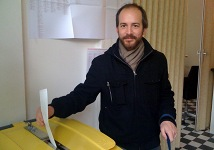

{.left}

Cet après-midi je suis allé voter avec [Laurent](http://web.archive.org/web/20101029015922/http://www.laurentchambon.net/) et Sophie dans l'arrondissement du Midi (Amsterdam Zuid). Laurent a fait la photo. Les instructions étaient en néerlandais, en anglais, en arabe et en turc. Je m'étais renseigné avant donc j'ai su quoi faire cette fois sans lire toutes ces langues étrangères.

Laurent était venu avec les chiens, et c'est pour ça que je tiens une laisse tout en votant. Mais c'est n'était pas une raison pour voter pour le parti des animaux. Les gens du bureau de vote étaient vraiment cool avec nous, ils étaient content qu'on anime un peu leur après-midi. Il n'y avait pas beaucoup de queue.

**Les singularités des bureaux de vote aux Pays-Bas**. 

L'isoloir n'a pas de rideaux, ça peut paraître gênant au premier abord mais le bulletin de vote est tellement grand que ça laisse de la place pour le déplier. 

Le bulletin de vote aligne toutes les listes et certaines ont une trentaine de candidats. Il faut remplir la case à coté du candidat choisi à l'aide d'un crayon rouge fourni. On ne peut voter que pour une personne, si on veut voter pour un parti, il suffit de choisir la tête de liste, si on vote pour une personne au milieu de la liste, ce dernier gagne des votes préférentiels qui lui permettent de gagner places dans la liste et d'avoir de meilleurs chance d'obtenir un siège. 

Autre particularité, il n'y a pas besoin d'émarger, [la carte d'électeur](http://meinamsterdam.nl/mars-2mois-des-elections) que je brandissait sur mon article d'hier est conservé par le chef de bureau, comme preuve de ma participation au scrutin.

Enfin, on le voit sur la photo, on dirait que je glisse un papier dans une poubelle. C'est exactement ça, l'urne est une bête poubelle en plastique avec un cadenas en guise de scellé. Les néerlandais qui [n'utilisent pas ce récipient pour leurs ordures](/eugene-poubelle-prefet-amsterdam) ont trouvé une utilisation pratique de ces bacs en plastiques. Mais tout de même, ça fait bizarre.

<!-- post notes:
lien was http://www.laurentchambon.net/2010/03/vote.html
--->
