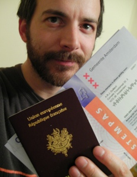

2010 est une année électorale pour les français aux Pays-Bas. Deux scrutins dans le royaume au nord et un scrutin dans la république du sud. Les électeurs n'auront à se déplacer qu'une fois pour les deux scrutins aux Pays-Bas tandis que les français auront à se déplacer deux fois pour un scrutin à deux tours.

On pourrait raconter que les Pays-Bas sont plus efficaces dans l'organisation de leurs élections et  se débrouillent pour faire déplacer les électeurs le moins possible pour éviter de faire grandir l'abstention. En fait, l'abstention est déjà là et c'est le mode de scrutin qui fait que les néerlandais n'ont généralement à se déplacer qu'une fois pour une élection. Voici la liste des élections à venir.

{.right}
**3 mars 2010 : élections municipales**. À part quelques villes ayant eu des scrutins avancés, l'ensemble des Néerlandais vont élire leur conseils municipaux. Pour ma part, [je voterais pour l'arrondissement d'Amsterdam Zuid](/bientot-les-elections-municipales), un nouvel arrondissement regroupant Oud-Zuid, Rivierenbuurt et Zuider-Amstel. Le scrutin est proportionnel, chaque parti présente une liste de candidats et le nombre de suffrages se portant sur chaque liste détermine le nombre de candidats qui pourra siéger au conseil municipal. Le rôle du conseil municipal est grosso-modo le même qu'un conseil municipal français à ceci près qu'il n'élit pas le maire. Le maire est une personnalité nommée par la reine.

**3 mars 2010 : élections locales**. Je n'ai pas vraiment compris l'enjeu des élections locales. Le scrutin est à nouveau un scrutin proportionnel de liste mais l'assemblée élue n'est pas très en vue dans la vie politique néerlandaise. Il me semble qu'on pourrait comparer cela à une assemblée cantonale. Il semblerait que le maire cité plus haut est souvent choisit par le gouvernement au sein du parti qui a remporté la majorité des suffrages à cette élection locale. [Un article du forum](http://leforum.nl/index.php/events-section/38-evenements/167-les-elections-municipales-du-3-mars-2010) explique le fonctionnement de la démocratie municipale. Pour ma part je vais participer à ces élections pour le secteur d'Amsterdam.

J'ai reçu mes cartes d'électeur, je vais donc participer à ces deux scrutins.

**14 mars 2010 : premier tour des élections régionales**. Les conseil régionaux sont, en France, élus par un scrutin proportionnel à deux tours avec une prime majoritaire. Cela peut paraitre curieux compliqué mais c'est le compromis actuel avec la tradition française du scrutin majoritaire à deux tour. Les français tiennent à cette prime majoritaire pour permettre au gagnant de gouverner avoir besoin de louvoyer pour créer une coalition bancale.

**21 mars 2010 : deuxième tour des élections régionales**. Les listes ayant obtenu moins de 5% des voix au premier tour sont éliminés, les listes ayant reçu entre 5 et 10% des voix ne peuvent pas se représenter mais elles peuvent fusionner. Enfin les listes ayant recueillis plus de 10% des suffrages peuvent se présenter au second tour mais souvent, elles décident elles aussi de fusionner pour augmenter leur chances.

Il est fort probable que je ne participe pas à ce scrutin parce que j'ai été radié des listes électorales à Paris. Normalement il est possible pour un français de l'étranger de rester inscrit en France pour les élections locales. Il semblerait qu'il y est eu une erreur. Je vais donc tenter un recours et je vous tiendrais au courant.

**9 juin 2010 : élections générales**. Avec [la chute du gouvernement](/balkenende-iv-est-tombe), la reine a convoqué des élections générales le 19 juin prochain pour en une nouvelle chambre des députés (deuxième chambre) . J'aurais le temps de vous parler à nouveau de ce scrutin.

## Quelques liens supplémentaires pour vous préparer à ces élections

* Sur le Forum : [Le 3 mars, n'oubliez pas votre carte d'électeur et pièce d'identité](http://leforum.nl/index.php/events-section/38-evenements/167-les-elections-municipales-du-3-mars-2010)
* Kreukreuscopie : [Pour qui voter à Amsterdam (ville) ?](http://kreukreuscopie.blogspot.com/2010/03/pour-qui-voter-amsterdam-ville.html)
* Kreukreuscopie : [Pour qui voter à Amsterdam Midi ?](http://kreukreuscopie.blogspot.com/2010/03/pour-qui-voter-amsterdam-midi.html)
* Kreukreuscopie : [Le vote occidental](http://kreukreuscopie.blogspot.com/2010/02/le-vote-occidental.html)
* Kreukreuscopie : [Aller voter](http://kreukreuscopie.blogspot.com/2010/02/aller-voter.html)
* Sur le forum : [discussion sur les élections municipales](http://www.leforum.nl/forum/viewtopic.php?f=5&t=22328)

## La suite :
[A voté](/a-vote)
