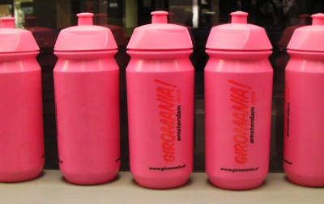

On a fait beaucoup de bruit en France sur la venue du [tour de France à Rotterdam](http://www.letour.fr/2010/TDF/COURSE/fr/grand_depart_2010.html). Le tour de France avait déjà fait [étape en Pays-Bas en 2006](/etape-en-pays-bas) et après avoir eu des départ depuis Dublin ou Londres, ce devrait être bien de faire un départ depuis la capitale Néerlandaise. Amsterdam voulait le tour mais le dossier déposé auprès des organisateurs n'a pas séduit. C'est de Rotterdam que partiront les coureurs en juillet.

Amsterdam a révisé sa copie et c'est finalement le tour d'Italie qui va démarrer d'Amsterdam cette année. Ça tombe bien, le vainqueur de l'année dernière, Denis Menshikov courrait pour l'équipe néerlandaise du tour: [Rabobank](http://www.rabobank.com/content/about_us/sponsoring/cycling/index.jsp).

<!--excerpt-->

En fait, avec le Giro, Amsterdam a fait les choses en grand, il y aura **3 départs à Amsterdam**: [1ère étape](http://www.giromania.nl/), samedi 8 mai, un contre la montre individuel allant de **Museumplein** au **stade olympique**, [2ème étape](http://www.rondevanitalieutrecht.nl/home) le dimanche 9 mai, en direction d'**Utrecht**. [3ème étape](http://www.giromiddelburg.nl/), lundi 10 mai nouveau départ d'Amsterdam, direction **Middleburg** en Zélande. Après ces trois dates, le Giro reprendra son cours normal en Italie

<!-- HTML -->

{.center}
Design bidon avec un logo rouge sur fond rose

<!-- / HTML -->

## Un grosse logistique

La logistique a été rodée, la première étape va s'accaparer de nombreuses rue de la ville mais les piétons pourront les traverser en utilisant des passerelles spéciales (et publicitaires). De plus les ponts que les coureurs emprunteront seront remplacés par des navettes de bateaux autorisant les civils à traverser les canaux aussi. Pour manquer le [Festival des très courts](http://veryshort.nl/), il faudra inventer une autre excuse...

## De nombreux évènements à coté de la course

Chacune des étapes possède son propre site, mais le plus complet est celui d'Amsterdam, Giromania, qui propose depuis début avril un calendrier d'activités autour du Giro. Expos thématiques, soirées spéciales et menus «Giro». sont à la carte de certain musées, cafés et restaurants. Bien sûr, comme il s'agit d'un évènement sportif, il y a aussi plein d'activités sportives avec maillot rose proposées. De nombreux tours à vélo mais aussi des courses à pied. Je sais que [drooderfiets](http://drooderfiets.tumblr.com/post/135269601/rabobank) par exemple s'est inscrit pour le [Girotoertoch](http://www.girotoertochtamsterdam.nl/) du dimanche 9. Venez donc l'encourager.

