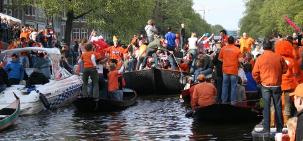

Vous allez arriver tard jeudi après un [voyage en Thalys](/le-thalys-a-moins-grande-vitesse) que j'espère pas trop pénible. Il se fera tard mais puisque vous arrivez un jour spécial, je vous propose de rentrer directement dans le vif du sujet. Le 29 avril, veille de la fête de la reine, c'est ce qu'on appelle *Koninginnenacht*, **la nuit de la reine**. Après un petit remontant, il faudra absolument explorer les bars du coin pour voir comment les locaux font la fête. Et puisque vous logez dans une ancienne rade de port, il y a forcément quelques cafés bruns dans les environs ou les marins se réchauffaient encore autrefois à grande rassade de [genievre](http://fr.wikipedia.org/wiki/Geni%C3%A8vre_(boisson)) (*jenever*). Ça aussi il faudra goûter pour se mettre dans l'ambiance.

Après vous irez dormir dans votre bateau et je rentrerais chez moi à vélo. Je ne sais pas encore si je slalomerais déjà entre les stands de broc que les gens [installent sur les trottoirs](/nouveau-mot-bezet) tôt le matin. On verra.

Le lendemain c'est **la fête de la reine**, [Koninginnedag](/koninginnedag). Il vous faudra prévoir des tenues oranges ([ça se vend](/preparatifs-oranges)) si vous ne voulez pas avoir l'air ridicules. Vous devriez aussi prévoir de la petite monnaie pour aller chez les particuliers qui font visiter leurs toilettes, c'est toujours interessant, surtout si on fait comme tout le monde en buvant de la bière en écoutant un défilé de bateaux biga-orangés qui font boum boum sur les canaux. Mon meilleur souvenir de la fête de la reine était cette année ou je l'ai passée sur un bateau, au milieu du défilé des [dingues en orange](/hoeden). Je pense que nous aurons la possibilité de monter sur un bateau mais il faudra me le dire à l'avance que je réserve.
<!-- HTML -->

<!-- / HTML -->
[{.center}](/pas-de-fete-du-travail)
Image d'archive: Koninginnedag sur les cannaux
<!-- HTML -->

<!-- / HTML -->
Le soir, quand les rues se parsèmeront et que seuls les mecs bourrés resteront à danser devant des podiums sans musique, nous irons boire un coup à la maison. J'ai un chouette appartement et ce serait dommage de ne pas en profiter avant que je m'en sépare. On pourra comparer les affaires qu'on a fait sur les brocantes de rue ou bien d'autre chose. Si vous vous emmerdez chez moi, il y aura assez à faire dans mon quartier, le Pijp est toujours animé.

Ce n'est pas confirmé mais il est fort probable que **les éboueurs soient en grève** le lendemain de la fête de la reine. C'es le premier mai alors ce n'est pas un poisson d'avril. Avec [tous les détritus](http://drooderfiets.tumblr.com/post/105759249/rubish-koninginnedag) que koninginnedag génère, ça va vite puer, il est préférable de se faire la malle et de voir s'il n'y a pas trop de bouses dans les campagnes environnantes. J'ai en tête deux circuits possible, le long de l'Amstel (la rivière, pas la bière) vers Ouderkerk et dans le Noord près du Waterland. J'ai un petit faible pour la seconde, plus variée à mon goût mais on décidera ensemble.

<!-- HTML -->

<!-- / HTML -->
[{.center}](/les-moulins-d-amsterdam)
Image d'archive: On peut aller voir ce moulin
<!-- HTML -->

<!-- / HTML -->

Le samedi soir, je devrais hélas vous quitter. Mon boulot [me réclame ailleurs](http://www.ripe.net/ripe/meetings/ripe-60/). Je décolle de Schiphol le soir, non sans avoir prodigué tous les bons conseils pour passer un bon dimanche. Je suis désolé de ne pas pouvoir rester avec vous. N'oubliez pas que si vous avez des billets retour en première, vous pourrez utiliser la lounge executive à la gare centrale d'Amsterdam, c'est toujours ça de pris.

Si vous décidez de rester une semaine de plus, vous pourrez assister au départ du [tour d'Italie](/amsterdam-maniaque-du-giro) et aussi voir le [festival des films très courts](http://www.veryshort.nl/) qui se montre **pour la première fois à Amsterdam**. J'y serais. Si vous ne décidez pas de rester, je serais quand même, mais n'hésitez pas à revenir, il y a toujours quelque chose à faire à Amsterdam.
---
<!-- post notes:
http://www.funda.nl/koop/amsterdam/appartement-29573923-cornelis-trooststraat-35-iii/
--->
