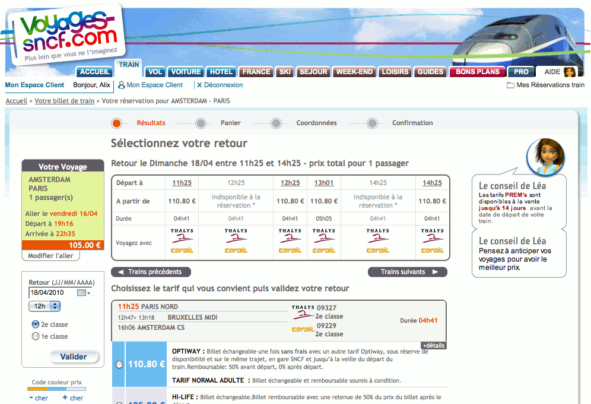
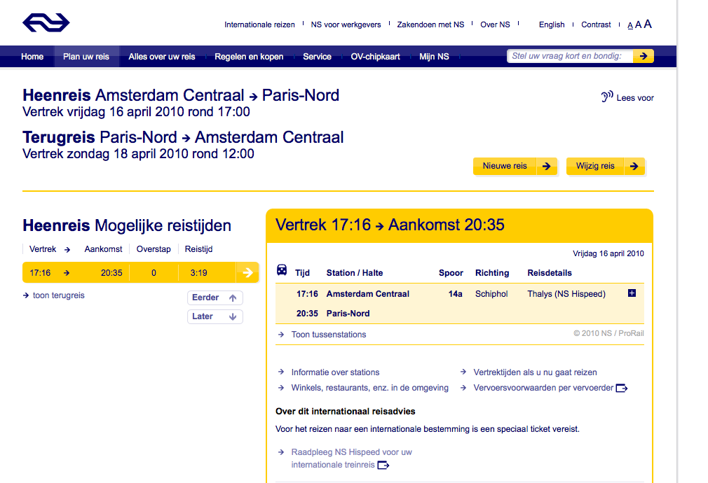
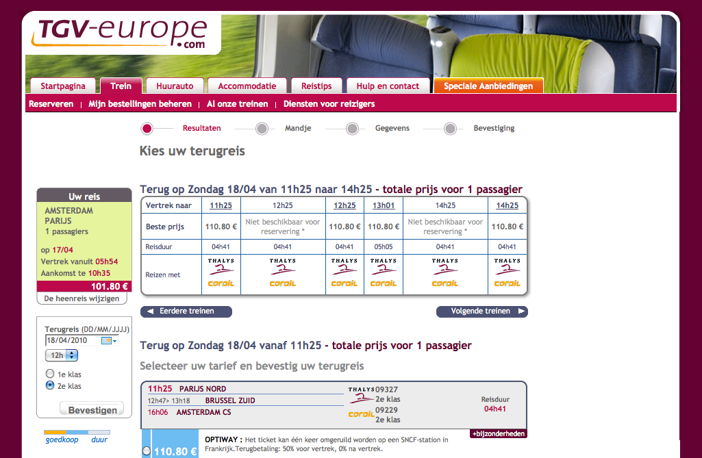
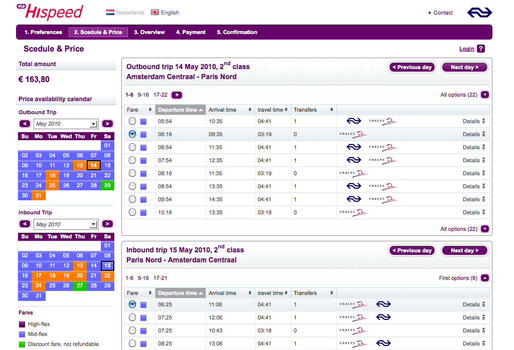
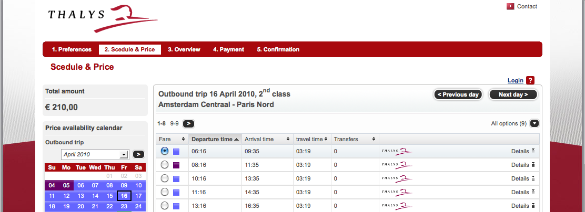

Vous m'avez vu ([en bien](/tintin-conduit-le-thalys) ou [en mal](/le-thalys-a-moins-grande-vitesse)) partir en **Thalys** entre Paris et Amsterdam. Pour celà j'ai du acheter mon billet. On me demande souvent quelle est la meilleure façon d'acheter son billet. Je vais donc passer en revue les 4 sites qui vendent des billets Thalys: **voyages-sncf**, **NS**, **tgv-europe**, **hi-speed**.

## Voyages SNCF
{.center}

Le site **Voyages SNCF** a longtemps été un exemple de site web à ne pas suivre. Home page surchargée, aucune option intuitive, pages de pub intermédiaires interdisant l'utilisation du bouton «précédent» de son navigateur etc. Même si nombre de ces inconvénients subsistent sur Voyages SNCF, certaines améliorations rendent la réservation d'un billet de train plus facile. L'ajout récent de la possibilité de lister les trains suivants (hélas pas les trains du lendemain) ou de changer la date en cours de réservation rend le processus moins pénible. les prix sont affichés clairement et la première classe est proposée si elle est avantageuse. Mais on ne peut toujours pas avoir d'aperçu de tous les trains de la journée ni de son aller-retour. Une fois qu'on a réussi a choisir son horaire et sa place, la réservation et le payement du billet est facile. L'envoi de billets par courrier est pratique mais ce n'est stupidement valable que pour la France.

## NS
{.center}

Le site de la compagnie nationale Néerlandaise ne permet plus d'acheter de billets Thalys. Il redirige vers son site Hi-Speed (voir ci-dessous) réservé aux voyages internationaux. Dommage, le site NS connait par cœur le nom des stations et les propose dès qu'on a tapé trois lettres dans le formulaire. Une fonctionnalité qui manque sur le site français qui ne sait même pas reconnaitre le mot «Amsterdam» (vous voulez peut être dire «Amsterdam» répond-il).

## TGV Europe
{.center}

Lorsqu'on veut acheter un billet depuis les Pays-Bas et qu'on l'indique sur le site Voyage-SNCF, on est redirigé vers le site néerlandais de TGV Europe. La langue néerlandaise nous est imposée et les nom des stations change. le site ne connait pas Paris-Nord mais propose PARIJS NORD (75) (sic). On retrouve les inconvénients de l'interface lourde de la SNCF qui est plaquée sur le site. Quelques bugs ajoutent à la frustration comme *Uw Speciale Aanbiedingscode is ongeldig ?* (code d'offre spéciale non valide) alors que j'ai laissé la case vide. Pour le reste, le choix des trains et le règlement est facile. Les sites de la SNCF donnent l'avantage de choisir sa place dans le train ce qui est un plus appréciable. TGV Europe envoie les billets par courrier dans toute l'Europe ce qui est pratique mais nous impose la langue du pays de destination ce qui peut poser problème aux expatriés.

## Hi Speed
{.center}

Le site de la compagnie NS pour les voyages internationaux semble reprendre les bonnes idées du site national comme la suggestion des gares à la frappe. Sur **Hi Speed**, la langue est néerlandais mais *Parijs* n'est pas une station référencée, on nous propose «Paris Nord» à la place. La page de résultats pour les choix des billets permet de voir les option pour l'aller et le retour en même temps. Le calcul du prix total se fait en temps réel ce qui est pratique pour jauger le prix de chaque option. Les codes couleur pour les prix sont aussi bien identifiable mais, gros inconvénient, on ne trouve pas toujours le moins cher. Les billets promos sont-ils réservés à la SNCF ? Autre gros inconvénient, quand un billet première classe est moins cher, il n'est pas proposé, il faut toujours lancer une autre recherche avec l'option *upgraden* (un clic) pour vérifier les opportunités. La possibilité de lister tous les trains du jour peut aussi être intéressante. Une fois le voyage choisi, le reste de l'achat du billet est simple et rapide. À noter que les payement par carte de crédit sont facturés comme souvent sur les sites de vente en ligne néerlandais. Par contre, le billet est envoyé par courrier gratuitement.

## Conclusion
Aucun site ne mérite d'être nominé à un concours de site web.

Mais depuis le temps qu'ils existent, les grosses erreurs d'utilisabilité ont été corrigés et tous remplissent plus où moins leur fonction. Une fois l'organisation des sites apprise, on y organise son voyage sans trop de problèmes, même si on aurait aimé y passer moins de temps. L'interface Hi-Speed est intéressante pour trouver les plans horaires qui conviennent mais je préfère commander mes billets sur TGV Europe à cause des promotions plus facilement identifiables et de l'absence de frais pour règlement en carte de crédit.

{.center}

## Et le site de la compagnie Thalys ?
Le site [Thalys.com](http://www.thalys.com/) n'est pas vraiment un site de vente de billet. Les interfaces utilisés sont celle du pays choisi à l'entrée du site pour la réception des billets. Même procédure que Rail-BE pour la Belgique, **Hi-Speed** pour les Pays-Bas et **voyages-SNCF** pour la France. Thalys.com offre néanmoins l'avantage de traduire chacune de ces interfaces dans les *quatre langues Thalys*. Pratique pour les français qui veulent acheter via Hi-Speed et ont des problèmes avec le khreukhreu.
