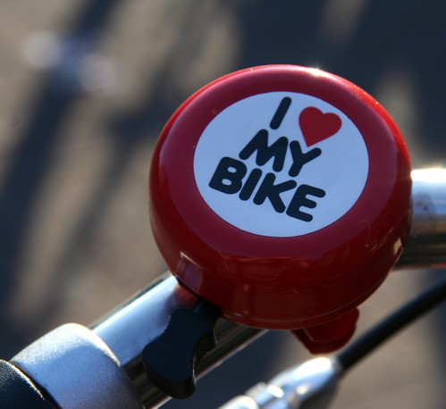

[{.center}](http://drooderfiets.tumblr.com/post/242619881/sonnette)

Voilà maintenant plus d'un an que j'ai un nouveau vélo hollandais. Je vous en ai parlé à plusieurs reprises ([ici](/drooderfiets-mon-nouveau-velo) et [là](/photos-drooderfiets-balade)) et vous avez pu suivre ses aventures sur [tumblr](https://pixelfed.social/drooderfiets), [facebook](http://www.facebook.com/#!/drooderfiets), [twitter](http://twitter.com/drooderfiets), [flikr](http://www.flickr.com/photos/drooderfiets/), [Hyves](http://drooderfiets.hyves.nl/?&pageid=3475YOSGN0004KCWW) et autres sites web sociaux. Pendant un an, drooderfiets postait quotidiennement des photos de lui dans toutes les positions et devant tous les paysages. Il se faisait des amis sur facebook et sur plein de blogs de vélos dans le monde entier.

Depuis presque deux mois, c'en est fini.

<!--excerpt-->

## Un blog qui se meurt
Il y a encore des photos en stock, prêtes à être postées mais plus de temps pour faire des mises à jour, répondre aux commentaires... mes mois d'avril et de mai ont eu raison de la vie sociale de drooderfiets. Pourtant j'étais bien parti pour tenir un an avec cette photo quotidienne. Première [photo le 22 avril 2009](http://drooderfiets.tumblr.com/post/98910205/berlage-statue) et dernière photo régulière [le 7 avril 2010](http://drooderfiets.tumblr.com/post/503592977/pedestrian-bridge), l'année était presque couverte mais... #fail. dommage.

Drooderfiets a fêté ses un an en mars. J'aurais pu poster des photos en détail des points de rouille ça et là, comme j'ai fait [jadis sur mon vélo français](/revision-du-btwin). Les vélos hollandais qui dorment dehors prennent, eux aussi, la marque du temps. Je m'en sert toujours quotidiennement et les gnons ne se comptent plus.

## Un anniversaire raté
Pour les un an de drooderfiets, j'avais plusieurs projets en tête, un bouquin, une nouvelle sonnette, un vrai site web, un happening à Riverenburt, une selle plus confortable, une nouvelle sonnette, une révision... Il n'y a pas eu d'anniversaire. J'ai essayé de conserver les idées jusqu'au un ans du blog de drooderfiets mais là encore il ne s'est rien passé, vu l'échec du blog expliqué ci-dessus, ce n'est pas étonnant.

## Un voyage qui s'annonce laborieux
Pour ce week-end j'ai promis de faire un pèlerinage à l'usine AZOR dont drooderfiets sort. C'est loin et c'est une belle idée de sortie à travers les Pays-Bas. La chambre d'hotel est réservée et le rendez-vous est pris lundi (31) matin avec le directeur. J'ai planifié la route depuis des semaines espérant prendre un chemin pitoresque incluant une traversée en bateau à voile entre [Enkhuizen et Hurk](http://www.willem-barentsz.nl/html/veerdienst_urk_enkhuizen.html). J'ai découvert hier que le Willem Barentsz ne prenait ce service qu'à partir du 5 juillet... nouveau fiasco? C'est bien partit pour, ils annoncent de la pluie.
