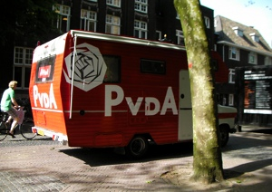

Les élections générales ont lieu dans un peu plus d'une semaine. Depuis la [démission du précédent gouvernement](/balkenende-iv-est-tombe) ([Balkenende IV](/nieuw-kabinet-balkenende-iv)), le paysage politique a beaucoup évolué. La campagne n'a pas toujours été passionnante mais pour vous mettre à la page, voici un petit résumé des épisodes précédents.

**Le gouvernement Balkenende IV est tombé** le. Cette coalition de chrétiens et de sociaux-démocrates se crêpait le chignon sur plein de sujet. La raison de la rupture est l'engagement militaire néerlandais en Afghanistan. Les Socialistes avait dit oui en 2007 à condition que la mission se termine en 2010. L'OTAN et les chrétiens démocrates ont voulu prolonger la mission après 2010. Les socialistes ont imposé une fin de non recevoir. La coalition s'est brisée.

Généralement le parti qui met fin à une coalition de gouvernement tombe das les sondages. Ce fut le cas du D66 quand [le gouvernement Balkenende II est tombé](/balkenende-ii-est-tombe). Dans le cas présent, c'est le CDA, parti de Balkenende qui chute. Après presque 10 ans au pouvoir à la tête de plusieurs coalitions hétéroclites et contradictoires, *Harry Potter* ne séduit plus. **Jan Peter Balkenende** s'accroche au pouvoir malgré une certaine opposition au sein de son parti ce qui le rend encore moins sympathique.

{.center}

À l'inverse, le PvdA qui devrait baisser dans les sondages parce qu'il est la cause de la chute du gouvernement, après un score médiocre aux municipales, remonte. Son leader, **Wouter Bos**, ancien vice-Premier-Ministre à laisser la main à une grande figure du parti: **Job Cohen**, estimé Maire d'Amsterdam. Pour pouvoir se présenter aux élections, ce dernier à laissé temporairement son fauteuil de maire à son collègue de parti **Lodewijk Asscher**, jeune loup qui s'accroche déjà assez au fauteuil pour flinguer les négociations pour former une coalition municipale. Le D66, aui a réalisé un bon score dans la capitale s'estime déjà lésé. À mois que ce ne soit un argument dans les négociations... Lodewijk Asscher doit encore faire ses armes en politique et il a déjà des détracteurs.

{.center}

À l'inverse au CDA, certain montrent que la politique n'est pas une fin en soit. Au moment de la chute du gouvernement, le ministre de la justice, **Ernst Hirsch Ballin** a annoncé le 16 mars, mettre fin à sa carrière politique à l'issue des élections du 9 juin. Sa motivation: la famille. Il explique qu'être ministre prend beaucoup de temps et qu'il voudrait maintenant passer du temps avec sa femme et son fils. Respect.

Le dernier parti de gouvernement n'a pas changé de tête. La Christen Unie était une petit parti d'apoint dans la coalition et **André Rouvet** est responsable de la réussite de ce parti avec sa participation au gouvernement. Il n'a pas de raison de laisser tomber.

Même chose dans les partis d'opposition. Cela peut paraitre évident pour **Gert Wilders**, à l?extrême droite, qui est le seul à décider dans son parti (le PVV) n'acceptant pas les militants. Toujours à droite mais dans un parti plus ouvert, **Rita Verdonk** à la tête de TON[^1], espérant un siège sans trop y croire. Les écolos de Groenlinks et les démocrates de D66 conservent aussi leurs têtes de partis **Femke Helsema** pour le premier et **Alexander Pechtold** pour le second, ont tous deux fait un travail d'opposition constructif et pertinent au sein de la deuxième chambre, ils affichent clairement l'ambition participer au prochain gouvernement[^2]. Grosse ambition aussi au VVD, le parti libéral. **Mark Rutte**, à la tête du troisième grand parti historique des Pays-Bas fait une campagne tranquille et profite du rejet du gouvernement sortant. Il est actuellement en tête des sondages, talonné par Job Cohen.

Seul parti d'opposition à présenter une nouvelle tête de liste est le SP, tout à gauche du spectre politique néerlandais. Ce parti avait été porté au pinacle par **Jan Marijnissen** leader charismatique à poigne dont le sommet fut l'arrivé en troisième place aux élections générales de 2006, avec 25 sièges. Jan Marijnissen a commencé à avoir de graves problèmes de santé en 2008 et a laissé sa place à **Agnes Kant**. Cette dernière, vu les résultats des élections municipales [montrant la déconfiture du SP](/les-pays-bas-basculent-a-droite), a cédé sa place à son colègue de parti **Emile Roemer** Un homme neuf dans cette arène puisqu'il n'est député que depuis 2006.

Les élections ont lieu le 9 juin prochain. Nous saurons alors lequel de ces noms en gras pourra prétendre devenir **Premier Ministre des Pays-Bas**.
---
[^1]: Oui je sais, ça sonne mal mais on va dire que j'ai laissé cette formule exprès.
[^2]: Femke Helsema a un avantage, elle n'a jamais participé à un gouvernement, elle n'a donc aucune casserole. Mais les électeurs ont la mémoire courte et le charismatique Alexander Pechtold semble placer le D66 en bonne position dans les sondages.