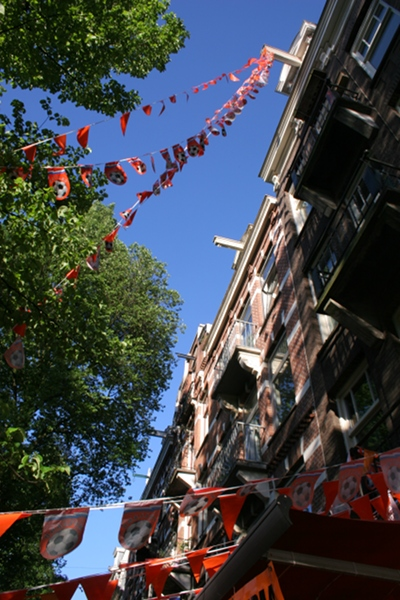
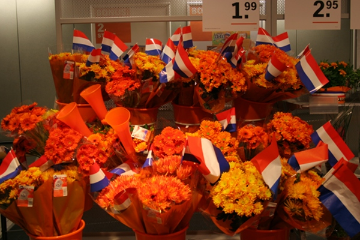

La coup d'envoi de la coupe du monde a eu lieu le 11 juin mais il est difficile de dire quelle sera la date retenue aux Pays-Bas. Ce 15 juin est certainement la journée la plus marquante jusqu'à présent puisque c'est la première journée de jeu de l'[équipe nationale des Pays-Bas](http://www.fifa.com/worldcup/teams/team=43960/index.html). 

Pourtant, encore plus que d'habitude, les Pays-Bas se sont transformés en dessin animé ou tout est orange. On ne compte pas les devantures de cafés qui sont couvertes de bannières aux couleurs royales et les drapeaux qui volent au vent un peu partout comme [pour la coupe d'Europe](/les-drapeaux-oranges). Les plus incongru sont les vitrines des magasin qui n'ont rien à tirer du mondial et qui sont décoré de la même manière. Du magasin d'engais en bas de chez moi à l'opticien en passant par le sex shop du coin, tout le mon à des vitrines foot et orange.

{.left}
Sur les panneaux d'affichage, une grande partie des pubs parlent du foot. Les bières d'abord avec Jupiler[^1], bière officielle et Heineken, bière officielle aussi mais juste de l'équipe des Pays-Bas. Mais aussi plein d'autres produits qui n'ont pas vraiment rapport avec le foot.

Tous les commerces y vont de leur petite campagne pour l'occasion. Albert Hein n'y coupe pas. Après [les welpies](/qu-allons-nous-faire-de-nos-welpies) il y a quatre ans et [les wolpies](/qu-allons-nous-faire-de-nos-wuppies) il y a deux ans, voici maintenant [les Bessies](http://www.ah.nl/beesie), toujours le même genre de boule de poils colorée, à coller ou on veut et offerte dès 5 euros d'achat. Mais Albert Hein ne s'arrête pas là. de nombreux produits oranges sont en tête de gondole et plus de la moitié des fleurs vendues dans le magasin sont de la couleur de la tunique d'Alix l'intrépide.

<!-- HTML -->

<!-- / HTML -->

{.center}

D'autres magasins se teintent de la même couleur pour l'occasion. Blokker se remet à vendre son [T-shirt qui rugit](http://www.youtube.com/watch?v=79GJHd_ZOX8) et plein d'autres offrent des cadeaux oranges pour un minimum d'achat. Le gadget le plus prisé est bien sûr **la vuvuzela**, la trompette sud-africaine qui se décline ici en plastique orange uniquement. La poste (TNT) en offre pour 5 euros d'achat de timbres et Albert Hein en cloque dans ces bouquets de fleurs. Ici on appelle ça un *toetoeter* (toutouteur en français) mais ce n'est pas parce que le nom est différent qu'il y a moins de boucan.

À chaque compétition j'ai l'impression que la surenchère promotionnelle dépasse tout ce qu'on a pu voire avant. Je ne sais pas si c'est une impression ou si c'est vrai mais une chose est claire, il y a plus de boucan.

Voir aussi : [Amsterdam 2013 : le printemps orange](http://meinamsterdam.nl/Amsterdam-2013-printemps-orange)

---
[^1]: Jupiler est la pils du groupe InBev qui a racheté un brasseur sud-africain il y a quelques années cela explique surement pourquoi Heineken n'a pas eu ce marché. Voir [Les bières Néerlandaises](/les-brasseries-neerlandaises)
<!-- post notes:
http://www.youtube.com/watch?v=-cpnnzhimjQ&feature=player_embedded 
http://sphotos.ak.fbcdn.net/hphotos-ak-ash1/hs559.ash1/32574_1480543810822_1150597787_1407893_463140_n.jpg
--->
