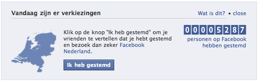

Ce matin, une petite banière a été ajoutée en haut de ma page facebook. Une banière me rappellant que c'est aujourd'hui jour des élections générales aux Pays-Bas. Facebook essaye de montrer qu'il a beaucoup d'utilisateurs aux Pays-Bas en affichant un compteur avec le nombre de gens affirmant avoir voté aujourd'hui. 

{.center}

Ceci n'a pas valeur de sondage, même si les Nérlandais ont peu de retenue pour affirmer qui ils votent, il y en aura toujours pour ne pas donner cette information à Facebook. Pour ma part, la petite opération du site social est un flop; bien que résidant aux Pays-Bas, je ne peux pas voter à ces élections puisque je suis étranger. Le filtre géographique de Facebook a ses limites.

Facebook n'est pas le plus gros site web communautaire aux Pays-Bas, Le site local [Hyves](http://www.accuweather.com/en-gb/EUR/IT/IT009/Milano/Forecast2.aspx) a beaucoup plus d'utilisateurs néerlandais que facebook et un trafic quotidien plus important aux Pays-Bas[^1]. Je suis donc allé voir ma page Hyves pour voir si on y parlat des élections. Hyves a aussi une banière spéciale mais plus adaptée au public néerlandais, je vous laisse découvrir ci dessous l'autre gros sujet d'actualité:

{.center}
---
[^1]: De sources internes et [externes](http://www.alexa.com/topsites/countries/NL)