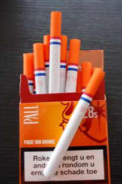
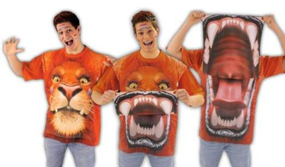
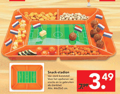
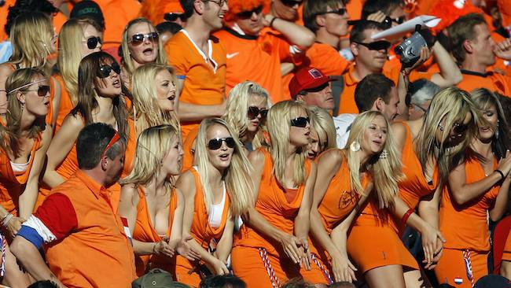

Depuis le début de la coupe du monde, le concours d'oranges a commencé. C'est un concours ou l'on rivalise de ridicule pour proposer un truc unique et orange. 

## Les cigarettes

{.center}

Les cigarettes d'il y a 4 ans sont toujours en vente mais elle ne gagneront pas le concours. J'ai l'impression qu'elle ne marchent pas trop, il y a beaucoup moins de mégots orange sur les trottoirs

## Les bannières et les fanions

<!--  TODO: Add image alt {.center} -->

Ici, les habitants de ce quartier ont essayé de battre le record de la plus longue bannière (*photo perdue*)

## Le t-shirt qui rugit

{.center}

Blokker, magasin à l'enseigne orange a déjà marqué les esprits avec [un T-shirt stupide qui rugit](https://www.youtube.com/watch?v=H1BeH45biQ0). Ici c'est un plateau repas patriote qu'ils proposent pour moins de 8 euros.

{.center}

## La bavaria dress

<!-- HTML -->

<object width="640" height="385"><param name="movie" value="http://www.youtube.com/v/cq2zDpRn0bU&hl=nl_NL&fs=1&"></param><param name="allowFullScreen" value="true"></param><param name="allowscriptaccess" value="always"></param><embed src="http://www.youtube.com/v/cq2zDpRn0bU&hl=nl_NL&fs=1&" type="application/x-shockwave-flash" allowscriptaccess="always" allowfullscreen="true" width="640" height="385"></embed></object>

<!-- / HTML -->

**Bavaria** n'a peut-être pas réussi à être la bière officielle de la coupe du monde mais la marque de bière arrive à faire parler d'elle avec un gadget distribué dans certains packs: La **Dutch Dress**. Elle a un tel succès que [la FIFA a du l'interdire](http://www.iol.co.za/index.php?set_id=6&click_id=2871&art_id=vn20100615044444433C406692)... Bon il faut aussi voir ce que cela donne en dehors de la pub:

<!-- HTML -->

<object width="480" height="385"><param name="movie" value="http://www.youtube.com/v/ZzDTtHMFfRo&hl=nl_NL&fs=1&"></param><param name="allowFullScreen" value="true"></param><param name="allowscriptaccess" value="always"></param><embed src="http://www.youtube.com/v/ZzDTtHMFfRo&hl=nl_NL&fs=1&" type="application/x-shockwave-flash" allowscriptaccess="always" allowfullscreen="true" width="480" height="385"></embed></object>

<!-- / HTML -->

L'interdiction de cette robe a eu lieu après que les mannequins ci-dessous ait été bien en vu lors du match contre le Danemark. Il semble que la présence de ces manequins soit une opération organisée par Bavaria qui n'est pas le sponsor officiel de la coupe du monde. Cela a donc valut à certaines d'entre elles de se faire arrêter.
{.center}

## C'est quoi cette bouteille de lait ?
Dernière photo, glanée sur facebook, puis ailleurs. Photo qui vous fait penser, même là ils mettent du orange... et oui, c'est partout qu'on mange du foot aux Pays-Bas.

<!-- {.center} 
TODO: external ressource
-->
---
<!-- post notes:
https://endasscicli.wordpress.com/2010/06/30/mondiali2010-le-bionde-hostess-birraie-olandesi/ 
oranje meiden
http://www.oranje-gekte.nl/meiden/Weer_de_Bavaria_meiden/
--->
