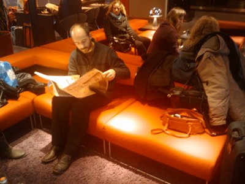

Troisième et dernier volet de mon comparatif des services Thalys entre la France et les Pays-Bas, les *lounge executive*. Il s'agit plus d'une information qu'un comparatif parce que l'accès aux salons élitistes dans les gares n'est pas réservée aux hommes d'affaire qui ont des billets de train en or massif. Vous aussi vous pouvez y accéder, profiter du wifi gratos et vous faire servir un café à l'?uil. Comme à chaque fois, les différences sont grandes entre les Pays-Bas et la France alors voici comment y accéder à Amsterdam et à Paris.

## La Lounge d'Amsterdam CS
{.left}
Tout détenteur de billet première classe du jour peut accéder à la [lounge HiSpeed d'Amsterdam](http://www.nshispeed.nl/nl/treinstations/ns-hispeed-lounge). des fruits, biscuits et un bar vous y attend. Il y a aussi des ordinateurs et des tables pour poser son iPad. ceux qui préfèrent lire le journal peuvent le faire tranquillement sur les banquettes et les toilettes sont hyper propres. La lounge est situé à l'étage de la gare, sur le quai numéro 1, là ou l'on peut aussi trouver des cafés mais la lounge, ça fait tellement plus classe. Il faut noter que les passagers des premier Thalys de la journée ne peuvent pas en profiter parce que la lounge n'ouvre ses portes qu'à 8h00 bien sonnées. Avant, il faut se contenter d'un café. Pour les malheureux détenteurs d'un billet Thalys 2ème classe, l'astuce est d'**acheter un billet première vers une destination moins chère**. Le sésame doit avoir coûté un minimum de 10 euros ce qui correspond à un voyage en première vers **Almere Buiten** (10,90?) par exemple. Ça fait cher le café mais l'accès wifi gratuit ammorti vite l'investissement. Une dernière chose, les Thalys partent généralement du quai 13 qui est à l'autre bout de la gare. Ne vous laissez pas surprendre.

## La Lounge Gare du Nord à Paris
Pour accéder à la lounge exécutive de la gare du Nord, le billet première classe ne suffit pas. Il faut présenter une carte de membre attestant de son appartenance à l'élite. Les cartes acceptées sont les cartes de fidélité et d'abonnement de la SNCF dont la carte grand voyageurs. d'ailleurs la lounge s'appelle **Salon grand voyageur**. Pour ceux qui voyagent peu en France, l'achat de cette carte n'est pas un bon investissement mais il est possible de demander gratuitement la carte [Thalys TheCard](https://www.thalysthecard.com/) qui  vous permet d'entrer fièrement dans le salon grand voyageurs. Le salon est situé [coté rue de Maubeuge](http://www.gares-en-mouvement.com/infos_pratiques.php?gare=frpno&tab=accueil#attente), sous l'escalier pour prendre l'Eurostar.
