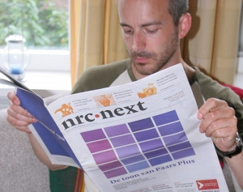

La folie orange a fini de battre son plein et l'on décroche lentement les banderoles qui ont souillé les rues pendant plus d'un mois. Tout le monde salue les joueurs de l'équipe nationale pour leur belle performance mais comme ils ne sont toujours pas champions, on passe à autre chose. Pendant la coupe du monde les pourparlers pour former un gouvernement sont allés bon train et maintenant que le sport n'occupe plus le devant de la scène, on se rend compte de ce que pourrait être le prochain gouvernement: Une alliance VVD-PvdA renforcée par Groenlinks et D66. Un alliance qu'on appelle **violet plus** (paars-plus).

## La coalition violette

En mai 1994, les électeurs ont placé en tête le parti travailliste (PvdA) passant devant les démocrates chrétiens (CDA). Les grands gagnants furent les libéraux (VVD) gagnant 9 sièges et les centristes (D66) avec 12 sièges de plus. Le CDA, grand perdant de ces élections n'a pas participé au gouvernement qui en est sortit. L'alliance des libéraux, dont la couleur est bleue et des travaillistes, dont la couleur est rouge a reçu le surnom de coalition violette. Le gouvernement dont **Wim Kok** fut premier ministre eut aussi ce surnom (*Paars kabinet*).

Cette coalition violette semble contre nature, alliant un grand parti de gauche et deux partis de droite mais le [gouvernement de Wim Kok](http://fr.wikipedia.org/wiki/Cabinet_Kok_I) a souligné les points communs de ces partis insufflant une politique libérale dans une société qui demandait moins de conservatisme. Les élections de 1998 ont conforté la position des principaux partis de la coalition, offrant à Wim Kok un [nouveau mandat de premier ministre](http://fr.wikipedia.org/wiki/Cabinet_Kok_II) jusqu'en 2002.

## La coalition violette plus

<!-- HTML -->

<!-- / HTML -->
{.center}
Un lecteur du **nrc next** est en train de choisir son ton de violet
<!-- HTML -->

<!-- / HTML -->

Cette fois , les résultats des [élections](/jour-d-elections), bien que mettant le VVD et le PvdA en tête, n' offre pas assez de sièges à ces deux partis pour gouverner avec une majorité de députés et le D66 n'est pas assez gros pour compéter cette alliance. C'est donc le parti vert des Pays-Bas, Groenlinks qui est consulté compléter cette hypothétique coalition. L'ajout du vert teinterait assez méchamment le violet et c'est pour cela que l'on parle de coalition violette-plus.

----

**mise à jour du 21 juillet 2010**

En fait, au moment de publier cet article, j'apprend que la coalition violette-plus ne verra pas le jour. Les négociations ont capoté hier au sujet des solutions à apporter pour lutter contre la crise. Sur ce point, les gens de droite et les gens de gauche ont des idées trop différentes. Le *Telegraaf* et *De Pers* titrent ce matin que c'est à la reine de décider maintenant...

----

**mise à jour du 16 août 2010**

La coalition evisagée pour le moment semble être celle d'une coalition minoritaire de droite avec le soutien de l'extrème droite. Lire «[Vers un gouvernement minoritaire ?](/un-gouvernement-minoritaire)» pour en savoir plus.
---