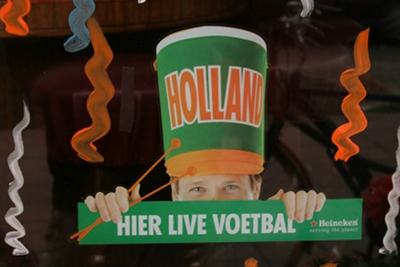
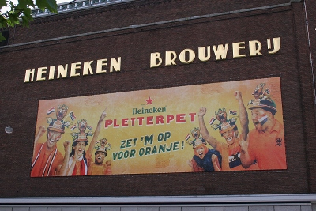

On ne dirait pas comme ça, mais le football et la bière m'aident à parfaire mes connaissances à l'occasion de la coupe du monde. Vous vous souvenez, il y a quatre ans, de [Marco et Marko, deux supporters néerlandais](/la-hollande-pour-la-france) qui faisait de la pub pour Heineken à l'occasion de la coupe du monde. Ces derniers vendaient un **chapeau tyrolien** faisant office de porte-voix et de produit d'appel pour acheter encore plus de cannettes de bières.

Ce marketing bourrin et ingénieux avait un bon coté. Les gens s'instruisaient de manière ludique. Les gens découvraient ainsi une coiffe traditionnelle allemande tout en rotant et en beuglant le nom de millionnaires. On peut remercier cette grande marque de bière de vouloir nous apprendre des choses à chaque occasion. Je ne m'étais pas rendu compte de cela jusqu'à ce que je tombe sur une publicité pour l'objet publicitaire de 2004 à l'occasion de la coupe d'Europe.

## Les chapeaux des supporters

{.center}

**Cette coupe d'Europe a eu lieu au Portugal** et cette image me rappelle les spectacles de tambours (*on dit bombos*) que j'ai apprécié la dernière fois que je suis allé à Lisbonne. 

## Le pletterpet

Les chapeaux Heineken avait donc un rapport avec le pays hôte de  la compétition... Le truc bizarre que le brasseur propose cette année était ridicule et n'a pas la caution culturelle évidente de **la vuvuzela**, distribué par [tous les marchands du pays](/football-tous-en-orange). Heineken a appelé ce chapeau le **pletterpet** et en a fait une grosse pub sur son siège social, mais je n'ai pas vu grand monde affublé de ces chapeaux.

{.center}

Je n'avais pas compris que ce *Pletterpet* était en fait un chapeau traditionnel de supporter de foot en Afrique du sud et que le choix du brasseur était de faire adopter aux néerlandais les traditions du pays hôte. Le site [Pletterpet.nl](http://www.pletterpet.nl/pletterpet.html), antérieur à la campagne, nous explique l'histoire récente de ce chapeau aux Pays-Bas et on apprend qu'il s'agit en fait d'un casque de mineur découpé et décoré. En Afrique du Sud on appelle ce chapeau un **[Makarapa](http://fr.wikipedia.org/wiki/Makarapa)**. Les Sudafs [en sont dingues](http://www.makaraba.co.za/) et moi j'espère vous avoir enfin appris quelque chose avec tous ces [délires en orange](/surenchere-de-orange).
