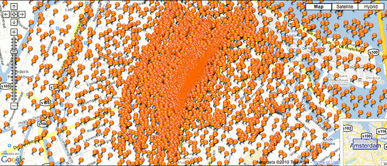
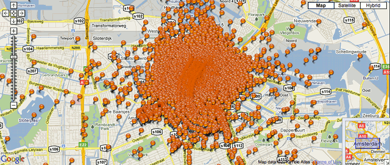

## Un bien meilleur but 

Le Volkskrant nous rappelle aujourd'hui que l'**UNICEF** a [fait campagne](http://www.scoormeevoorunicef.nl/) tout au long de la coupe du monde pour [aider les enfants défavorisés](https://www.unicef.nl/wat-kunt-u-doen/betrokken-ondernemen/wk-actie-scoor-mee-voor-unicef.aspx) en construisant des écoles. L'équipe gagnante qui apparait dans les spots télés à la mi-temps et propose aux gens de verser **1,50 euros par but marqué** par leur équipe préférée (c'est uniquement possible avec les Pays-Bas). Finalement, plus les Pays-Bas vont loin dans la compétition, plus l'UNICEF peut construire d'écoles. Merci Persie et Snijders...

<!-- HTML -->

<object width="640" height="385"><param name="movie" value="http://www.youtube.com/v/oy9XISMDC0A&amp;hl=nl_NL&amp;fs=1"></param><param name="allowFullScreen" value="true"></param><param name="allowscriptaccess" value="always"></param><embed src="http://www.youtube.com/v/oy9XISMDC0A&amp;hl=nl_NL&amp;fs=1" type="application/x-shockwave-flash" allowscriptaccess="always" allowfullscreen="true" width="640" height="385"></embed></object>

<!-- / HTML -->

## Panique sur les canaux

La finale de la coupe du monde n'est pas encore jouée que déjà on prépare la victoire. Si les Pays-Bas gagnent, l'équipe victorieuse rentrera au pays pour parader sur les canaux comme l'avait fait **la bande à Van Basten** en 1988. En 1988, les canaux étaient noirs de monde, les gens se jetaient dans l'eau pour approcher les joueurs. Un site propose donc de réserver sa place sur les canaux, pour quand l'équipe défilera le 15 juillet prochain: [oranjegrachten](http://oranjegrachten.nl/) (**les canaux en orange**). La carte d'Amsterdam est déjà submergée par les punaises oranges indiquant emplacement réservé.

{.center}
<!-- HTML -->

le midi

{.center}

le soir

<!-- / HTML -->

Tout ceci n'est qu'une grosse plaisanterie, en fait, la parade aurait lieu [le 13 juillet](http://amsterdam.nl/algemene_onderdelen/overige/wk_huldiging/nieuwsberichten?ActItmIdt=341765). Mais l'organisation de cette parade rappelle des mauvais souvenirs. En 1988, les supporters étaient montés, comme souvent, sur le toit des *woonboot*, ces bateaux qui servent d'habitation. Ces derniers étaient si nombreux que **plusieurs bateaux ont coulé** et des familles ont tout perdu. Cet évènement est encore suffisamment présent dans les esprits des gens pour justifier la nouvelle pub pour les assurances Apeldoorn, compagnie réputée pour ses polices compliquées et ses pubs rigolotes.

<!-- HTML -->

<object width="640" height="385"><param name="movie" value="http://www.youtube.com/v/mzGFbELkvgI&amp;hl=en_US&amp;fs=1"></param><param name="allowFullScreen" value="true"></param><param name="allowscriptaccess" value="always"></param><embed src="http://www.youtube.com/v/mzGFbELkvgI&amp;hl=en_US&amp;fs=1" type="application/x-shockwave-flash" allowscriptaccess="always" allowfullscreen="true" width="640" height="385"></embed></object>

<!-- / HTML -->
