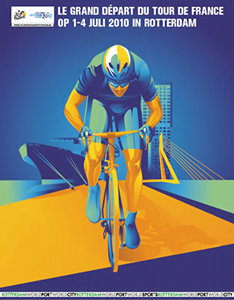

{.left}
**Amsterdam** a eu le [Giro d'Italia](/amsterdam-maniaque-du-giro), c'est maintenant le moment du [tour de France](http://www.letour.fr/2010/TDF/COURSE/us/le_parcours.html). La grande boucle française, elle aussi démarre des Pays-Bas mais de **Rotterdam**. Le choix a été fait avant celui du giro et Amsterdam était aussi candidate. **La capitale avait déjà accueilli le départ du tour** [en 1954](http://en.wikipedia.org/wiki/1954_Tour_de_France), année ou le tour démarrait en dehors de l'hexagone pour le première fois de son histoire. Comme il faut changer un peu c'est Rotterdam qui a été choisie pour [le grand départ](http://www.tourdefrancerotterdam.nl/). Amsterdam s'est consolé au printemps en hébergeant le départ du giro.

**Rotterdam** est très fière d'être le départ de cette course mythique. [Delftse Poort](http://en.wikipedia.org/wiki/Delftse_Poort) (La porte de Delft), l'une des plus grande tours de la ville est aux couleurs du tour depuis plusieurs jours maintenant. On attend des millions de visiteurs et ce n'est pas si commun dans cette ville plus connue pour son port et ses bureaux que pour quelconques évènements.

Il n'est pas possible de savoir si le tour va avoir du succès ici tant le son des vuvuzalas couvre tout le reste mais la ville de Rotterdam a pris toutes les dispositions nécessaires. Dans le métro, on recommande aux gens, de ne pas prendre sa voiture le jour du prologue (**3 Juillet 2010**). **Un contre la montre bloquera les grands axes de la ville**, pont Erasme compris. Pire, les messages recommandent de ne pas prendre son vélo non plus. Ceci en parfaite contradiction avec le film qui fait la promotion du tour, de la ville et de ses cyclistes :

<!-- HTML -->

<iframe width="560" height="315" src="https://www.youtube.com/embed/tRksR1jdt3c" title="YouTube video player" frameborder="0" allow="accelerometer; autoplay; clipboard-write; encrypted-media; gyroscope; picture-in-picture" allowfullscreen></iframe>

<!-- / HTML -->

Voir aussi : [Étape en Pays-Bas](/etape-en-pays-bas) (2006) et [Le tour d'Espagne recolonise les Pays-Bas](/le-tour-d-espagne-recolonise-les-pays-bas) (2009)
---