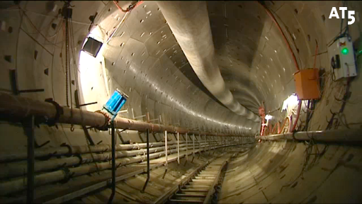

On parle souvent des déboires et des trucs qui ne vont pas. Faire mauvaise presse est toujours plus vendeur pour la presse. Rien de plus chiant lorsque les choses se déroulent comme prévu. Ainsi l'achèvement du premier tunnel de la ligne de métro Nord-Sud à Amsterdam a ainsi fait très peu de bruit. C'est pourtant un progrès formidable et tout s'est déroulé selon les attentes.

<!-- HTML -->

<!-- / HTML -->
{.center}
La Noord-Zuidlijn ([ligne Nord-Sud](/la-ligne-du-nord-au-sud)) avance selon AT5
<!-- HTML -->

<!-- / HTML -->

C'est là que les médias auraient du se rendre compte de la singularité de l'évènement, jusqu'à présent la construction de la *Noord-Zuidlijn* ne s'est jamais déroulée comme prévu. J'ai parlé ici des [multiples reports d'ouverture de la ligne](/travaux-n-en-finissent-toujours-pas), des rallonges budgétaires et des [maisons qui s'écroulent](/les-maisons-s-enfoncent) à proximité des travaux. Tout cela n'a eu lieu que lors de la construction des stations souterraines, les tunnels entre les stations n'étaient pas encore commencés. Ça promettait...

En fait, le 30 juin dernier, les services de la ligne Nord-Sud ont annoncé l'achèvement du premier tunnel entre Damrak et Rokin. L'information a été couverte mais avec la coupe du monde, elle est passée à la trappe. On peut quand même retrouver [le reportage d'AT5](http://www.at5.nl/artikelen/43769/eerste-buis-noord-zuidlijn-gegraven), la télé locale qui est la première à montrer ce tunnel suivit de peu par [Het Parool](http://www.parool.nl/parool/nl/2584/Noord-Zuidlijn-video-s/video/detail/297008/NZ-lijn-Een-kijkje-in-de-tunnel.dhtml), le quotidien d'Amsterdam:

<!-- HTML -->

<object width="640" height="385"><param name="movie" value="http://www.youtube.com/v/stpiCgzl4Xo&color1=0xb1b1b1&color2=0xd0d0d0&hl=nl_NL&feature=player_embedded&fs=1"></param><param name="allowFullScreen" value="true"></param><param name="allowScriptAccess" value="always"></param><embed src="http://www.youtube.com/v/stpiCgzl4Xo&color1=0xb1b1b1&color2=0xd0d0d0&hl=nl_NL&feature=player_embedded&fs=1" type="application/x-shockwave-flash" allowfullscreen="true" allowScriptAccess="always" width="640" height="385"></embed></object>

<!-- / HTML -->

On y découvre comment les énormes tunneliers (*boormachine*) sont à l'?uvre, creusant leur chemin sous la ville et posant les voussoirs préfabriqués le long du tunnel. Le tunnelier qui a achevé ce premier tunnel s'appelle **Gravin**. Déjà, le site d'information de la ligne Nord-Sud [nous parle de la construction d'un autre tunnelier](http://www.noordzuidlijn.amsterdam.nl/tunnelboren/nieuws_tunnelboren/@342777/boorders_noord_9/): **Noordje** qui devrait réaliser le deuxième tunnel sur ce tronçon Damrak-Rokin. Le creusement de ce tronçon devrait s'achever fin 2010 et les tunnelier devraient ensuite déménager vers le sud, Scheldeplein, d'où ils devraient forer en direction de la [station Centuurbaan](/noord-zuidlijn-ceintuurbaan-station).
---