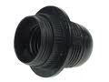

On dit souvent que les gens du sud ont un accent qui chante. Les toulousains, les provençaux ou les italiens sont décrits comme des gens qui chantent quand il parlent. Les néerlandais ne sont pas en reste.

## Nouveau mot: Doei

{.left}
Pour se dire au revoir, les Néerlandais disent «*dag!*» avec un «g» qui racle la gorge, l'abréviation de «*goede dag*» qu'on pourrait traduire par «bonne journée» et qui rappelle les canadiens qui se quittent en disant «bonjour». Depuis presque dix ans maintenant *les jeunes* ont introduit une variante de ce «*dag*» avec «*doei*» (**prononcez douille**) utilisé dans le même contexte. 

<!-- HTML -->

<audio id="mwe_player_0" style="width:175px" poster="//en.wiktionary.org/static/1.26wmf14/resources/assets/file-type-icons/fileicon-ogg.png" controls="" preload="none" class="kskin" data-durationhint="2.7831972789116" data-startoffset="0" data-mwtitle="Nl-doei.ogg" data-mwprovider="wikimediacommons"><source src="//upload.wikimedia.org/wikipedia/commons/b/b1/Nl-doei.ogg" type="audio/ogg; codecs=&quot;vorbis&quot;" data-title="Original Ogg file (248 kbps)" data-shorttitle="Ogg source" data-width="0" data-height="0" data-bandwidth="248379"></source>Sorry, your browser either has JavaScript disabled or does not have any supported player. 
You can <a href="//upload.wikimedia.org/wikipedia/commons/b/b1/Nl-doei.ogg">download the clip</a> or <a href="https://www.mediawiki.org/wiki/Special:MyLanguage/Extension:TimedMediaHandler/Client_download">download a player</a> to play the clip in your browser.</audio>

<!-- / HTML -->

On entend aussi parfois, une variante qui est la combinaison des deux «*doeg!*».

Ce mot a beaucoup de succès, aucun néerlandais n'oublie de le prononcer une ou deux fois lorsqu'il quite un ami. Le son «*oe*» (**prononcez «ou»**) porte et il incite les gens à aller le chercher dans les aigües. Surtout, quand on l'utilise, il faut le faire comme un essai de prolonger la conversation en le faisant durer. Toutes les combinaisons sont bonnes «*doei doei*», «*doedoei*», «*doehoehoei*», «*doeïoei*», «*hoeïe doei*» etc.

Vous aussi, essayez de vous dire au revoir à la néerlandaise. Vous verrez, vous allez chanter.
---