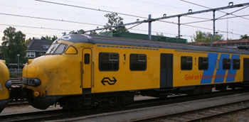
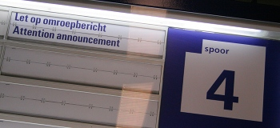

C'est un aventure somme toute banale qui m'est arrivée le 10 juillet dernier mais c'est aussi l'occasion rêvé pour vous parler de **la société néerlandaise des chemins de fer** (en Néerlandais on dit *Nederlandse Spoorwegen* ce qui est plus court mais plus compliqué). 

## La Nederlandse Spoorwegen

La **NS** est la société commerciale issue de l'ancienne compagnie d'état des chemins de fers (*Staatssporwegen*). Comme partout en Europe[^1], l'état a conservé l'activité de gestion des voies ferrées via l'organisme [Prorail](http://fr.wikipedia.org/wiki/Prorail) et privatisé l'exploitation commerciale des trains. Le transport des passagers est effectué par la NS tandis que le transport du fret, NS Cargo, est revendu à Deutsche Bahn est effectué par [Railion](http://fr.wikipedia.org/wiki/Railion) (aujourdh'hui **DB Schenker Rail**). Les Pays-Bas disposent d'un réseau ferroviaire dense et maillé. La NS assure des services fréquents et réguliers avec toutes les gares du pays à l'aide de trois type de trains: *Intercity* (grandes lignes), *Sprinter* (trains régionnaux) et *Stoptrein* (Omnibus). Certaines rames sont anciennes mais elles sont renouvelées petit à petit. Le confort dans les train est malgré tout convenable.

{.center}

## Les trains en retard et les autres 

Comme il faut toujours râler à propos du train, il faut souligner le défaut reconnu à la NS, les retards ou annulations répétées pour des raisons souvent météorologiques. Ceux qui arrivent en retard au boulot à cause des trains ont souvent la même excuse. Les feuilles en automne, le gel en hiver et les rails cassés en été ainsi que divers problèmes techniques qui ne sont pas toujours expliqués. C'est dans ces cas là que l'on découvre l'excellence néerlandaise dans la logistique de pacotille. L'information est souvent manquante ou erronée. Les passagers sont dispatchés aux mauvais endroits et les agents n'ont généralement pas la bonne réponse aux question des usagers. Les gens restent malgré tout courtois comme toute personne qui n'y peut rien et qui endure avec un flegme tout [protestant](/catholiques-et-protestants).

{.center}

À mon avis -mais je n'ai pas approfondi la question- la NS, privatisée depuis 1995, a une obligation de rentabilité. Le choix a été fait de conserver un minimum de matériel en *standby* et de personnel en astreinte comme le fait, par exemple, la SNCF. L?économie est réalisée sur les salaires, l'entretien et le stockage des matériels roulant mais il est parfois impossible de faire face à des problèmes plutôt prévisibles comme la chute des feuilles en automne ou les rails cassées en été. Ce choix économique n'est pas forcément judicieux parce que les problèmes entrainent beaucoup de frais. La NS a passé des accords de coopération avec les affréteurs de bus comme Connexion, Veolia ou Arriva pour acheminer les passagers immobilisés par un problème de train.

La densité du réseau et la fréquence des trains -Les Pays-Bas ont [le réseau ferré le plus chargé d'Europe](http://www3.informs.org/article.php?id=1356)- explique aussi la multiplication des retards pour un seul incident.

## Une aventure

N'ayant pas de voiture, je me déplace exclusivement à vélo et en transports en commun. Pour bouger aux Pays-Bas, je prends donc le train. Je suis en général satisfait du service mais il m'arrive d'avoir des déboires, comme le 10 juillet dernier. Cette histoire sera pour un prochain article: [À cause du mauvais temps](/le-mauvais-temps)

Ajout : en fait, on dit [Les Nederlandse Spoorwegen](/les-nederlandse-spoorwegen)
---
[^1]: C'est la [directive 91/440](http://eur-lex.europa.eu/LexUriServ/LexUriServ.do?uri=CELEX:31991L0440:fr:HTML) qui veut ça.