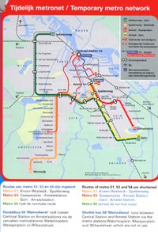

Ceux qui prennent les transports en commun **à Amsterdam** ont eu à leur disposition dans les trams et les bus, une petite brochure leur indiquant qu'un tronçon de métro était coupé pour travaux entre **Centraal Station** et **Amstel Station**. Ce tronçon est important parce que les 3 lignes de métro de la ville l'empruntent. La brochure explique donc tous les chemins alternatifs en tram ou en bus de remplacement.

[{.center}](/public/images/scans/cartes/metromap-s.jpg)

{.right}
La brochure indique aussi que les travaux qui auront lieu durant l'été vont permettre d'améliorer le confort et la qualité de service. Comme toujours. Seulement voilà. Les travaux n'auront pas lieu.

La ville et le contractant sont hélas (*helaas*) en litige et je ne sais pas si c'est le contractant chargé des travaux a dénoncé l'appel d'offreou la ville qui est revenu sur la signature de ce marché. En tout état de cause, **GVB, la compagnie des transports publics de la ville d'Amsterdam** doit passer un nouvel appel d'offre et cela devrait prendre du temps.

La réorganisation du transport, dut à la coupure de ce tronçon de métro a cependant bien été organisée, les chauffeurs ont pu poser plus de congés et les bus de remplacement ont été affrétés. Il n'est pas possible de rouvrir les lignes parce que les chauffeurs sont en congé. La ligne est donc coupée pour rien et on distribue de jolies brochures aux passagers pour s'excuser de la gène occasionnée.

<!-- post notes:
http://www.dutchnews.nl/news/archives/2010/07/amsterdam_metro_closed_for_fiv.php
--->
