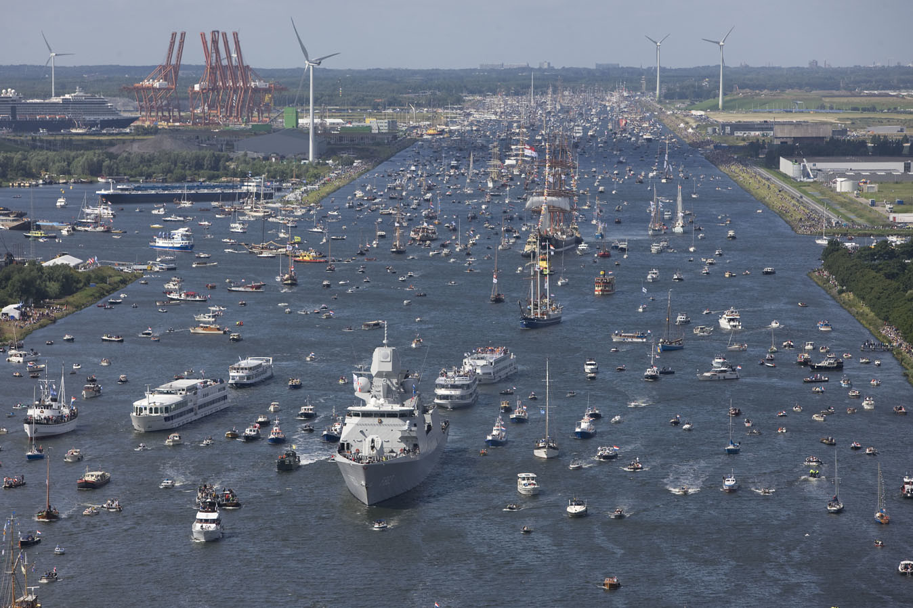

**Sail est un rendez-vous qui n'a lieu que tous les 5 ans à Amsterdam**. C'est dire si c'est un moment rare. À partir de jeudi 19, de grand gréements vont venir s'amarrer à Amsterdam pour une semaine. Ils seront alignés sur les quais des îles Java [dans le quartier de Zeeburg](http://www.sail2010.nl/bereikbaarheid#plattegrond). Les gens peuvent visiter les navires (le plus souvent des navire-écoles) et rencontrer les équipages du monde entier. C'est [Sail 2010](http://www.sail2010.nl/).

Le clou du spectacle est l'arrivée des bateaux en parade, ils seront accompagnés de nombreuses autres embarcations hétéroclites, des bateaux à vapeur, des coquilles de noix permettant de voir ça de plus prêt, des bateaux à aube, des *advocaatboot*, bateaux de maitre que leur propriétaires parvenus aiment à montrer les soirs d'été, des yacht de canaux, des barges, des zodiacs, trimarans et autres bateaux à voiles. tout le monde sera là.
  
[{.center}](https://www.flickr.com/photos/47533844@N07/4908017756/)
<!--Gone {.center} -->

Pour ceux qui rateront la parade cette année (comme moi) il y a la possibilité de revivre ce méli-mélo sur l'eau tous les soirs de la semaine. À la tombée de la nuit, un feu d'artifice est lancé depuis la rade de *IJhaven*, visible depuis les quais des îles de Java et KNSM et dans le *Oostelijk Havengebied* (les [docks de l'est](http://fr.wikipedia.org/wiki/Oostelijk_Havengebied)). Mais nombreux sont ceux qui veulent voir les jolis pétards colorés de plus prêt en allant sur l'eau. Le ballet des barques et bateaux recommence ainsi tous les soirs que ce soit des groupes de copains sur des frêles esquifs ou des sociétés invitants des VIP et clients sur un Yacht de location, on a l'impression que tout Amsterdam se donne rendez-vous là le soir. Heureusement que ça n'a lieu que tous les cinq ans.
