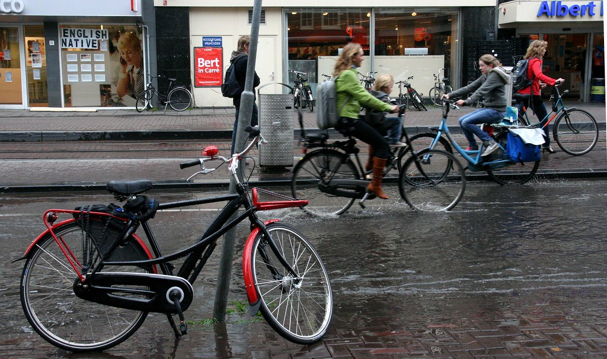

## Un vélo d'entreprise

En vous présentant [drooderfiets](https://pixelfed.social/drooderfiets), [mon nouveau vélo](/drooderfiets-mon-nouveau-velo), je vous ai dit que c'était [ma boîte](/mon-nouveau-boulot-3) qui me l'avait (presque entièrement) payé. Je ne vous ai pas parlé des avantages et des inconvénients rattachés à cette offre. coté avantages, ma boîte m'a aussi offert une assurance couvrant le vol, vandalisme ou autre destruction pour une période de trois ans. Coté inconvénients, la boîte ne me rembourse plus ma carte de transport (ce qui semble logique puisqu'elle m'a acheté un vélo pour me rendre au taf) pendant trois ans. Enfin, la formule indique que pendant cette période de trois ans, je n'ai pas le droit de profiter à nouveau de cette offre mais que je peux me faire rembourser 80 euros de frais (cadenas, entretien, équipement) par an pendant ces trois ans.

<!--excerpt-->

L'ensemble de ces dispositions ne sont pas obligatoires mais sont rendus possible par l'administration fiscale qui autorise ces avantages sans les taxer à hauteur de 750 euros par bicyclette et 250 euros par assurance pour trois ans ainsi que 80 euros de frais par an sur justificatif.

## Petits comptes et petites économies

Cette formule implique que chaque déplacement en transport en commun est payé de ma poche. Comme je possède maintenant un vélo, l'utilisation des transports en commun en ville est fortement réduite. Néanmoins, quand je reçois des visites ou qu'il pleut fortement, il est plus agréable d'utiliser le tram ou le métro. Comme la pluie est omniprésente dans le port d'Amsterdam, l'addition peut vite devenir salée, au point de rendre dérisoire la somme que mon entreprise m'alloue pour l'achat de mon vélo.

{.center}

J'ai donc décidé de faire un petit test:

La première année (de Février 2009 à Janvier 2010), je n'ai jamais utilisé le tram pour aller travailler. Je devais compter les jours ou j'arrivais trempé au boulot pour savoir le nombre de billets de tram économisés. Résultat de l'expérience, je n'ai été trempé que 3 fois (deux fois en hiver et un bel orage en été) pendant cette période.

L'expérience a ses limites. Je n'ai pas compté le nombre de déplacement personnels annulés à cause de la pluie ni les voyages effectués en transport collectifs simplement parce que c'était plus pratique.  Malgré cela, le résultat de l'expérience était sans appel: Je peux me passer de vêtement de pluie et le prix que je paye à prendre le tram est dérisoire.

Ceci conforte le choix que font de plus en plus de *vélotafeurs*[^1] en France et ailleurs dans le monde.

## Les limites de l'expérience

2009 a été une année particulièrement chaude et ensoleillée pour les Pays-Bas. On ne peut pas dire la même chose de 2010. Depuis Février 2010, alors que j'ai pris l'habitude de distinguer les averses pour les éviter, j'en suis déjà à cinq jours trempé. Et nous sommes encore en *été*. Le temps hivernal pourri est déjà arrivé à l'approche de l'équinoxe et il promet de durer.

Avec l'augmentation des tarifs du tram à l'occasion du [passage à la carte à puce](/la-ov-chipkaart), je vais surement devoir reconsidérer l'achat de vêtement de pluie

---
[^1]: Certain l'expliquent très bien sur [le forum vélotaf](http://www.velotaf.com/)