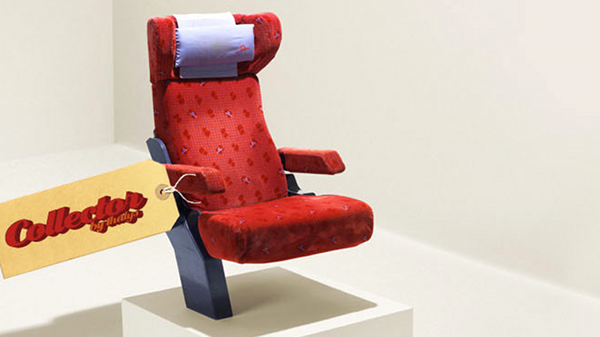

Je me suis souvent [plaint du Thalys](http://twitter.com/meinamsterdam/status/11146743214) sur ce blog ainsi que [sur mon twitter](http://twitter.com/meinamsterdam). Trop cher, [achats de billets pas pratiques](/thalys-comparatif-des-sites-web) et avec [souvent des retards](/le-thalys-a-moins-grande-vitesse). Il y a un autre problème dont je n'ai pas parlé c'est le confort. Beaucoup de rames se font vieilles et il serait temps de les rénover. J'ai déjà fait des voyages ou il faut fait trois ou quatre voitures pour trouver des toilettes qui ne sont pas hors services. Sur Thalys, les anciennes rames sont reconnaissables au filet porte-journaux qui pendouille devant soi. Ce n'est pas une super publicité...

<!--excerpt-->

Tanguy Lebreton, [conseiller des français à l'étranger](/assemblee-francais-etranger) pour les Pays-Bas, a lancé une [enquête de satisfaction sur le Thalys](http://www.lelionbleu.nl/?page_id=26) il y a presque six mois. Les problèmes de tarifs, de réservation et de restauration ont été évoqués ainsi que l'abandon de la déserte de La Haye. Sabine Cessou s'en est fait l’écho [dans Libé](http://www.lelionbleu.nl/?p=1353). Mais peu de sondés ont parlé de l'état de vétusté de certaines rames. Il faut dire qu'un siège reste un siège et que si l'on n'y fait pas attention, on ne remarque pas ce filet qui pendouille, ce velours rappé à ras et cet accoudoir qui grince. Seulement, quand on regarde [les ICE](http://www.nshispeed.nl/nl/ice/routes-ice-international) qui partent de la même gare centrale à Amsterdam, on voit bien quel train manque de confort...

Thalys est en train de réagir, depuis l'été, les délais sont mieux tenus et, enfin, les vieilles rames ([PBA](http://fr.wikipedia.org/wiki/TGV_PBA)) sont [en train d?être rénovées](http://www.thalys.com/de/fr/renovation
). Tout change, même les fauteuils. Le nouveau mobilier devrait intégrer des prises de courant et offrir [plus de place](http://www.thalys.com/de/fr/renovation). Un mieux qui fait du bien (j'ai testé dernièrement) mais qui n'égale pas encore le confort des ICE. Qu'à cela ne tienne, **la rénovation des rames Thalys est un grand progrès** que beaucoup attendaient.

Là ou personne n'attendait Thalys c'est le marché de l'occasion. l'ancien mobilier va être vendu aux enchères. [Une boutique spéciale](http://stores.ebay.fr/new-thalys) a été ouverte sur Ebay et déjà les enchérisseurs se ruent sur les fauteuils et les poubelles en alu. Les bénéfices des ventes seront reversées à l'[UNICEF](http://www.unicef.fr/). 

{.center}

Si vous voulez refaire votre intérieur, pourquoi pas essayer le *rail vintage*, vous pourrez même y ajouter les coussins que vous avez piqués en 1987 dans le train couchette qui vous emmenait en colonie de vacances et puis cette couverture que vous avez gardé de votre dernier vol long courrier...
