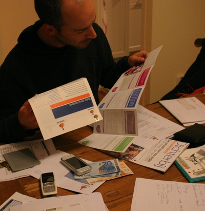

Ma banque, la Rabobank, m'a envoyé un courrier il y a quelques jours. Deux pages sérrées tout en Néerlandais. Le tout était accompagné d'un dépliant avec les nouveaux tarifs des forfaits bancaires. Ma formule [Rabo Totaal Pakket](http://www.rabobank.nl/particulieren/producten/betalen/voor_uzelf/rabo_totaalpakket/default) passe de 7,60 à 10,10 euros par trimestre. Ouch# ça fait mal!

Heureusement, après moult relectures, j'ai compris ce que disait la lettre. En gros, après avoir observé mes habitudes bancaires sur l'année passée, ma banque me conseille de souscrire une autre formule de compte meilleur marché et qui remplit tous mes besoins: le [Rabo DirectPakket](http://www.rabobank.nl/particulieren/producten/betalen/voor_uzelf/rabo_directpakket/default). Ce dernier coute 4,35 euros par trimestre. Il ne permet pas de faire des virements avec formulaire papier mais depuis que j'ai ouvert ce compte je n'ai fait que des virement internet. Aucun changement à prévoir.

Au delà du conseil, la lettre m'explique que le changement est déjà effectué depuis le 1er septembre et que si je désir revenir à la formule plus chère, il me suffit de le demander. Je n'ai rien à faire et c'est tant mieux.

{.center}

Je pourrais me réjouir que ma banque me fait faire des économies mais puisque c'est sur des frais qu'elle me facture tous les trois mois, je n'aurais toujours pas l'impression de faire une affaire. Toujours est-il que la Rabobank montre bien qu'elle soigne sa clientèle. C'est peut-être pour cela qu'elle est la première banque de détail du pays. 

Vous en connaissez beaucoup des banques en France qui ont cette politique d'offrir la formule moins-disante la plus adaptée à ses clients ?
