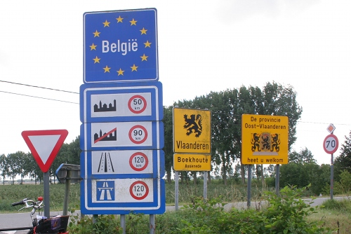

{.left} Le week end du 8 août Je suis retourné en Zélande pour voir si [Drooderfiets](https://pixelfed.social/drooderfiets), [mon nouveau vélo](/drooderfiets-mon-nouveau-velo/), apprécierait le paysage. La dernière fois que j'y suis allé, [en 2008](/au-bord-de-la-belgique), j'avais effectué le trajet en voiture et m'était promené le long de la frontière avec des amis. Cet été j'ai fait le voyage en train, prévoyant de faire une [petite boucle à vélo](http://www.facebook.com/photo.php?pid=501696&fbid=1248303986569&id=1798535697) dans cette province maritime du sud.

Sa proximité avec la Belgique souligne une frontière singulière et poreuse qui nous oblige à nous souvenir de l'histoire de l'indépendance de la Belgique.

## 2ème partie: L'indépendance de la Belgique

<!--excerpt-->

Quand on regarde la frontière qui sépare les Pays-Bas de la Belgique, on se demande ce qui a bien put se passer dans la tête de ceux qu'il l'on tracée. Elle ne suit pas de cours d'eau ou de montagne et pourtant elle est encore plus sinueuse que le trajet de mon pote Fergal quand il rentre à la maison bourré. Il faut dire que les relations entre les deux pays n'ont pas toujours été amicales. Les Belges ont gagné leur indépendance grâce à une guerre civile qu'ils ont gagné. 

## La guerre d'indépendance

En 1815, le nouveau roi des Pays-Bas, Guillaume Ier, réinstallé sur le trône par les anglais après la défaite napoléonienne est un monarque protestant, conservateur et réactionnaire. Les catholiques du pays (majoritaires dans le midi) ne sont pas bien traités, le roi les considèrent comme de la vermine. Alors que la majorité des habitants du nouveau royaume sont belges et catholiques, ces derniers sont sous représentés aux états généraux. La plupart des institutions et grandes compagnies avaient leur siège en Hollande ce qui ne laissait pas grande place aux Belges. Enfin, la langue néerlandaise officielle déplaisait aux francophones du sud.

{.right}
Les catholiques et les libéraux se sont alliés pour adresser leurs griefs au roi et faire acte d'opposition. En [juillet, août et septembre 1830](http://fr.wikipedia.org/wiki/R%C3%A9volution_belge), divers évènements en Belgique et décision du roi Guillaume eurent pour conséquence  la partition définitive de la Belgique du royaume des Pays-Bas. Le roi Guillaume Ier est âpre en négociation et négocie chaque acre de terre de son royaume. Il conserve le Luxembourg, obtient la scission du Limbourg en deux petites provinces de part et d'autre de la frontière et conserve des territoires protestants au sud de l'Escaut. Le tracé sinueux de cette frontière laisse entendre que les négociations ont été dures.

## La frontière Zélandaise

Ce bout de Flandre zélandaise est le plus emblématique. Sur les cartes des Pays-Bas, elle ressemble à une des îles de la province maritime mais si l'on y trace la côte le long de la Belgique on se rend compte qu'il s'agit d'une exclave Néerlandaise en Belgique. Territoire que des Belges ont revendiqué jusqu'au début de la seconde guerre mondiale.

La frontière entre les deux pays fut balisée par des [bornes frontières](http://fr.wikipedia.org/wiki/Borne_fronti%C3%A8re). D'un coté elles arborent le blason de la maison d'Orange, avec une lion armé d'une épée, de l'autre, les armoiries de la Belgique, un lion presque identique mais sans épée.

## La période Moderne

La rivalité entre les deux royaumes s'est vite estompée et le coté pragmatique de nos voisins du nord a repris le dessus. Les Pays-Bas et la Belgique ont, avec le Luxembourg, crée le [Benelux](https://fr.wikipedia.org/wiki/Benelux), une organisation de coopération économique qui a servi d'exemple à la création de l'Union Européenne. Les frontières entre les deux pays sont depuis longtemps libres et ouvertes. 

{.center}

Les ports de Gand et d'Anvers dépendent de la bonne volonté des Néerlandais pour leur accès à la mer, via l'[estuaire de l'Escaut](/voyage-en-zelande-traverser-l-escaut) pour Anvers et le canal Gent-Terneuzen pour Gent. L'entretien de ces voies de communication sont à la charge des Néerlandais mais réalisées en concertation avec les Belges. 

L'urbanisation croissante de la Flandre a créé des village-frontières où il est intéressant d'acheter son pain et sa bière coté belge et de se promener coté néerlandais. Mais j'en ai déjà parlé en 2008[^1]...

---
[^1]: Lire [Au bord de la Belgique](/au-bord-de-la-belgique).