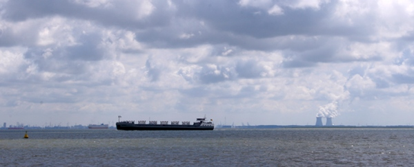
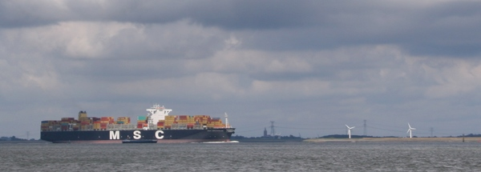

[{.left}|/public/images/scans/cartes/carte-tour-zelande.jpg||Tour de Zélande] Le week end d'août Je suis retourné en Zélande pour voir si [Drooderfiets](http://drooderfiets.tumblr.com/), [mon nouveau vélo](/drooderfiets-mon-nouveau-velo), apprécieraient le paysage. [La dernière fois que j'y suis allé, en 2008](/au-bord-de-la-belgique), j'avais effectué le trajet en voiture et m'était promené le long de la frontière avec des amis. Cet été j'ai fait le voyage en train, prévoyant de faire [une petite boucle à vélo](http://www.facebook.com/photo.php?pid=501696&fbid=1248303986569&id=1798535697) dans cette province maritime du sud.

## 1ère partie: Traverser l'Escaut

Il n'y a qu'une voie ferrée en Zélande, Elle va de Rosendaal à Flessingue (*Vlissingen*) en traversant la presqu'île de [Beveland du Sud](http://fr.wikipedia.org/wiki/Zuid-Beveland) et de [Walcheren](http://fr.wikipedia.org/wiki/Walcheren). Pour pouvoir retourner au bord de la Belgique, en Flandre Zélandaise, il faut traverser l'[Escaut Occidental](http://fr.wikipedia.org/wiki/Escaut_occidental). Le large estuaire est le seul accès à la mer du port d'Anvers, il est donc hors de question de construire des ponts d'une rive à l'autre. Il faut laisser la voie libre aux bateaux qui rallient le premier port de Belgique, un des plus grands d'Europe.

{.center}

Pendant de nombreuses années, les néerlandais ont assuré leur **continuité territoriale** avec des **services de bacs** qui chargeaient autos vélos et piétons de part et d'autre en plusieurs endroit de l'estuaire. Ce service de Ferrys s'appelait *Provinciale Stoombootdiensten* (**Service provincial des bateaux à vapeur**). Depuis longtemps les bateaux ont troqué leur vapeur par des fumés de gazole avant d'arrêter le service en 2003. Le site d'origine [psdnet.nl](http://www.psdnet.nl/vloot.html) en retrace l'épopée. En 2003, un tunnel a été ouvert **entre Teregengen et Ellewoutsdijk sur la presqu’ile de Beveland-du-Sud** (*Zuid-Beveland*) permettant aux voitures de passer d'une rive à l'autre en en temps record. L'ouvrage est impressionnant. Il est fort profond à cause de la profondeur des chenaux de l'estuaire, prévus pour des navires à fort tonnage. Les automobilistes qui remontent du sud se voient accueillir avec une barrière de péage. Le tunnel est **la seule voie routière payante des Pays-Bas**.

Le gain de temps pour les automobilistes est énorme et les liaisons par bateau ont fermés la même année. Seulement voilà les ferrys transportaient aussi des cyclistes et des piétons. Ces derniers ne peuvent emprunter le tunnel que par l'intermédiaire de bus, uniquement à l'endroit du tunnel. Ailleurs, lls se trouvent bloqués en Zélande, toujours du mauvais coté. La province a donc rouvert une ligne régulière de ferry entre **Flessingue** (*Vlissingen*) et **Berkents**. Le ferry transbordeur de voitures a été remplacé par un hydroglisseur de la compagnie BBA ([rachetée par Veolia](/les-petites-courses-de-l-ete)) qui assure la liaison toutes [les heures ouvrables du jour](https://www.veolia-transport.nl/fastferries/reisinformatie/plan-uw-reis/dienstregeling/index.html). Grâce à ce Ferry, **Bruges est à deux heures de vélo de la gare de Flessingue**(*Bruggs is twee huren fietsen van Vlissingen*).

La Zélande est une province très touristique et une seule liaison ne permet pas de satisfaire les nombreux randonneurs qui se promènent sur les polders sous le vent estival[^1]. Certains ont donc eu la bonne idée d'offrir un service de bac aux piétons et aux cyclistes accompagnés de leurs montures en différents points de la province. [Ce service](http://www.rondjepontje.nl/nl/welke.lp) n'est disponible que pendant les 3 mois d'été (juin, juillet et août) et coûte plus cher que le ferry régulier. Il couvre néanmoins de nombreux endroits en Zélande, ce qui offre un large choix de randonnées entre terre et mer.

> Pour en savoir plus sur les ferrys (*Pontjes*) en Zélande voyez le [site de l'office de tourisme qui les liste](http://routes.vvvzeeland.nl/nl/rondje-pontje/pontjes). 

### Nouveau mot : Pontje
*Pontje* est le diminutif de *pont*. Contrairement à son homonyme français le *pont* n'est pas un ouvrage d'art. Il désigne à l'origine une **barge** transportant les hommes ou les animaux sur les nombreux canaux du pays. Accouplé avec le mot *veer* qui signifie ferry, il devient pontveer et désigne un bac assurant la liaison entre deux rives d'un cours d'eau. En fait, on peut appeler tout bac ou ferry *pont*, ou *pontje* comme le fait le site de l'office de tourisme précité. On trouve aussi le nom de *veerboot*, traduction littérale du 'ferryboat'' anglais et qui désigne les mêmes bateaux.

{.center}

J'ai profité de **mon dernier week-end d'août aux Pays-Bas** pour tester ces traversées et vous en rendre compte. Les services de bac privés sont très sympathiques et amicaux tandis que le ferry de Veolia offre une ambiance plus anonyme de transport en commun. Quand on randonne à vélo, ces traversées sont des moments de repos privilégiées. J'attends maintenant avec impatience l'été prochain pour découvrir d'autres endroits de cette province et d'autres traversées.

## 2ème partie: Un petit tour à vélo

[Lire la suite de mon voyage en Zélande](/a-nouveau-en-zelande)
---
[^1]:  Bien que province méridionale, la Zélande reste aux Pays-Bas, le vent estival n'est pas forcément une agréable brise. En fait, la Zélande, province maritime plate est souvent balayée par des bourrasques
<!-- post notes:
http://www.voetveren.nl/sub-overzicht/zeeland.htm
--->
