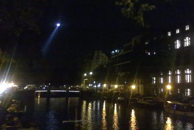
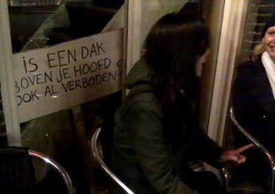

Ce vendredi l'actualité était chargée avec l'annonce d'un accord de gouvernement et l'entrée en vigueur de la nouvelle loi interdisant les squats. Le week end n'a pas été moins chargé...

### Bientôt un nouveau gouvernement bien à droite
Depuis les élections législatives de juin, le gouvernement n'avait toujours pas été constitué. Ce sera bientôt chose faite, avec [un gouvernement brun et minoritaire](/un-gouvernement-minoritaire)  puisque les trois partis en présence ont annoncé un accord vendredi. Sur cet accord, tout le monde y allait de son petit commentaire, qui de l'interdiction de la burka, qui du retour de la cigarette dans les bars, qui de la taxation des tickets de théâtre... Que des bonnes choses. La **revue de presse francophone** a listé les [points principaux de l?accord de gouvernement](http://www.ambafrance-nl.org/france_paysbas/spip.php?article12273) d'après le *Trouw*.

Mais le gouvernement n'est pas encore formé et il restait au CDA, le parti démocrate chrétien de valider cet accord lors du congrès de [ce samedi à Arnhem](http://www.cda.nl/Actueel/Nieuws/Nieuwsbericht/2010/10/39/CDA_congres_steunt_regeerakkoord_CDA-VVD.aspx). C'est maintenant chose faite. Les militants se sont prononcés à 62% pour la coopération avec le PVV contre 32%. 32%, c'est une grosse minorité, c'est un tout petit peu moins que le pourcentage de CDA (démocrates chrétiens) et VVD (libéraux) dans l'assemblée actuelle. Cette grosse minorité qui leur offre légitimité pour gouverner mais les oblige à demander le soutien du PVV (extrème droite) pour avoir une majorité de 76 sièges sur 150.

Ah, j'y pense, il y a deux députés du CDA qui ont démissionné pour montrer leur désaccord avec ce projet de gouvernement. Il n'en faudrait que deux autre qui au lieu de démissionner, fondent leur groupe, pour que le gouvernement n'ait plus une majorité le soutenant à la chambre basse...

### La fin des squats
Pendant ce temps là le gouvernement de transition avait fait passé une loi pour rendre illégal le fait d'occuper un immeuble sans autorisation. La loi est entrée en vigueur le 1er octobre 2010 et s'en est fini de la spécificité néerlandaise pour les squats. La communauté des *krakers* a donc réagit en organisant plusieurs actions au centre ville d'Amsterdam. Le week-end dernier ils campaient sur la place du Dam. Ce vendredi, ils défilaient entre Damrak et Spui, derrière une banderole affirmant «vos lois ne sont pas les notres» (*Julie wetten niet de onze*) ([Voir photos sur nu.nl](http://www.nufoto.nl/fotos/170817/krakers-demonstreren-op-het-damrak-in-amsterdam.html)). La manifestation a dégénéré et les violences ont duré jusque tard dans la nuit. Le journal popu *Telegraph* montrait une photo de guerre civile en première page. 

Il se trouve que j'étais dans le quartier à boire des coups ce soir là. J'ai vu passé de nombreux cars de police ainsi qu'un hélico qui a tourné pendant des heures.

{.center}

Quelques jeunes courraient dans la rue aussi. L'un d'eux était masqué, on aurait dit un bizutage... D'autres jeunes buvaient des coups dans les cafés du coin avec la pancarte posée dans un coin.

{.center}

Pour les amateurs de sensations fortes, je suis désolé mais je n'ai pas vu d'émeute, il est fort probable qu'il y ait eu des échauffourées mais les dégats ont surement été moindres que l'incendie d'un café qui a eu lieu la même nuit dans mon quartier. Rien d'une guerre civile mais un bon bar à bière que j'ai découvert dans le coin...

Hélas, le *Telegraph* est plus lu que mon blog et cela va conforter tout le monde dans les campagnes que la fin de cette loi est la bienvenue. Les *krakers*, eux, ont prévenu, cette loi n'est pas la leur, ils vont donc continuer.

### Pays libertaire
L'un des points de l'accord de gouvernement est le retour de l'autorisation de fumer dans les bars. Il faut croire que cette loi a été promulguée depuis des mois parce que nombreux sont les bars ou je vais où il est courant de voir les gens s'allumer une cigarette en toute nonchalence. Pas plus tard qu'hier, dans le bar ou je lisais le *Telegraph* et ou j'écoutais une courte [playlist de chansons françaises](/la-playlist-du-jour), la patronne et quelques clients on grillé quelques clopes sans que ça ne dérange personne. Peut-être que pour les cafetiers aussi [vos lois](/pays-bas-sans-tabac) ne sont pas les nôtres.

### Carnet nomade
Pendant que certains commentaient les résultats du congrès du CDA, d'autres passaient leur dimanche à écouter la radio. Ayant du rangement et du ménage à faire à la maison, j'ai opté pour la deuxième solution. Ce dimanche, à 14h00 sur France Culture c'était «Carnet Nomade». Ce dimanche, Collette Fellous nous emmenait à Amsterdam. [Son carnet de route](http://www.franceculture.com/emission-carnet-nomade-un-jour-a-amsterdam-2010-10-03.html), réalisé avant l'accord de gouvernement, revient sur le feuilleton des négociations et nous fait visiter les quartiers de quelques personnalités francophones de *Mokum A*. Très enrichissant, [à écouter](http://www.franceculture.com/player?p=reecoute-2863441#reecoute-2863441) sans attendre.
---