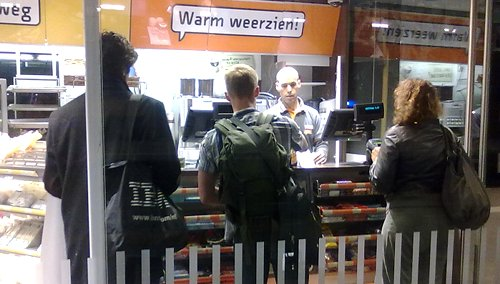

Parce que je n'ai pas le forcément le temps de vous parler de tout ce qui change dans ma vie, je reprends cette bonne habitude des «[en vrac](/en-vrac-et-debut-octobre)»...

### Date marquante 1 : Les trains se préparent à l'hiver
Le **10/10/10** était [une date marquante](/date-marquante) à plus d'un titre. Les [NS](http://fr.wikipedia.org/wiki/Nederlandse_Spoorwegen) (*Nederlandse Spoorwegen*) ont profité de ce qui a du être la journée la plus chaude d'octobre pour simuler des perturbations dues au froid. Scénario stupide ou des trains sont annulées sans véritable raison et ou des annonces expliquent que c'est à cause de la neige. En guise de compensation, les passagers en T. shirts pouvaient consommer gratuitement, soupes, thés ou cafés dans tous les cafés de toutes les gares. La simulation s'est bien passé puisqu'après avoir emprunté trois trains, je suis arrivé à bon port avec 30 minutes de retard.
<!-- HTML -->

<!-- / HTML -->
{.center}
On fait la queue pour les cafés gratuits
<!-- HTML -->

<!-- / HTML -->

La compagnie des chemins de fer néerlandaise est connue pour [excuser ses retards](/les-nederlandse-spoorwegen) à cause du gel ou des feuilles sur les rails. Elle essaye de montrer qu'elle se préoccupe de ces problèmes mais le scénario répété ce dimanche n'a aucune chance de se produire exactement comme simulé. Je doute que cette journée améliore leur gestion catastrophique des imprévus.

### Le nouveau gouvernement
On ne peut parler de ce mois d'octobre sans parler du nouveau gouvernement que le nouveau premier ministre **Mark Rutte** a formé. Rutte a fait le choix de l'expérience, le gouvernement se retrouve formé de 20 veux routards de la politique. Il y a seulement deux femmes et aucun représentant de minorités. Le premier ministre compte sur l'expérience de ses ministres pour palier le fait qu'il soit soutenu par une minorité de députés à l'assemblée. Ce que je vois surtout c'est qu'on se retrouve avec une classe politique conservatrice qui va utiliser des vieilles techniques politiciennes pour passer ses projets. Le gens ne vont pas s'identifier à ce gouvernement et c'est encore le populiste Wilders qui va gagner des points à ce petit jeu. La [Presse néerlandaise du lundi 11 octobre 2010](http://www.ambafrance-nl.org/france_paysbas/spip.php?article12298) présente quelques grandes figures de ce nouveau gouvernement.

### Date marquante 2 : Trois nouvelles communes
Le **10/10/10** était une date marquante à plus d'un titre (bis). Pour la première fois [les français étaient à la foire Expatica](/je-ne-suis-pas-un-touriste-le-salon) et voilà que les Pays-Bas comptent trois communes de plus. Les Antilles Néerlandaises ont cessé d'exister ce jour là. [Curaçao](http://fr.wikipedia.org/wiki/Cura%C3%A7ao) et [Sint Marteen](http://fr.wikipedia.org/wiki/Saint-Martin_%28Sud%29) (la partie néerlandaise de [l'île de Saint Martin](/15km-de-frontiere-commune)) sont devenus des Pays états autonomes du Royaume des Pays-Bas, comme l'était déjà [Aruba](http://fr.wikipedia.org/wiki/Aruba), un statut proche des [Collectivités d?outre-mer](http://fr.wikipedia.org/wiki/Collectivit%C3%A9_d%27outre-mer) (anciens TOM) pour la République Française. Les petites îles de [Bonaire](http://fr.wikipedia.org/wiki/Bonaire), [Saba](http://fr.wikipedia.org/wiki/Saba) et [Saint-Eustache](http://fr.wikipedia.org/wiki/Saint-Eustache_%28Antilles%29) sont quand à elles devenues communes spéciales des Pays-Bas au même titre que les [430 autres sur le continent européen](/regroupement-de-communes). **Les Pays-Bas comptent désormais 433 communes**.

### Bokbier
La [Herfst Bokbier (bière d'automne)](/la-herfst-bokbier-biere-d-automne) est arrivée. Je n'ai pas besoin de vous dire ce que c'est, je vous en ai déjà parlé en 2008. La nouveauté c'est ma participation à la fête de la bière d'automne à la fin du mois. Le [33e PINT Bokbierfestival](http://www.pint.nl/pint/bbf.htm) aura lieu à Amsterdam les 28, 29 et 30 octobre prochain. Si je ne fini pas trop bourré, je pourrais vous en parler.
---