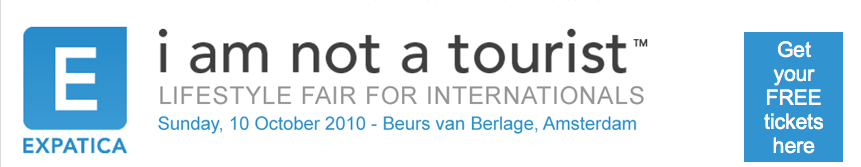

Il y a quatre ans, je vous avais présenté le salon [I am not a tourist](/i-am-not-a-tourist)? organisé par **Expatica**, une agence de communication anglophone qui s'adresse aux expatriés des Pays-Bas et d'ailleurs. Je me souviens avoir présenté mon compte-rendu à quelques personnes autour de moi regrettant l'absence des francophones alors que de nombreux français faisaient partie de la clientèle d'Expatica. Je me souviens avoir obtenu une adhésion gracieuse à [la chambre de commerce Française aux Pays-Bas](/le-temps-des-expatries) en échange de ce compte-rendu et de quelques brochures intéressantes... Il y a quatre ans déjà. Depuis, j'ai trouvé [un boulot](/mon-nouveau-boulot-3) et un peu quitté ce cercle d'expatriés francophones.

<!--excerpt-->

La newsletter de l'ADFE [m'apprend aujourd'hui](http://www.paysbas.francais-du-monde.adfe.org/agenda.php?lng=fr&idpg=5380/&pg=5380&agv=1) qu'il y aura **un stand « France »** à la prochaine foire d'Expatica «*I am not a tourist*». Je clape dans mes mains# Apparemment, je ne suis pas le seul à penser que l'absence de français à cette foire était marquante. Certaines personnes ~peut-être m'ont elles lu~ ont organisé un stand commun. Le stand a été retenu au nom de ...  la chambre de commerce Française aux Pays-Bas. Sur la brochure, vous trouverez *French Chamber of Commerce in the Netherlands* **au stand 35**, c'est `a cet endroit, au sein de la bourse de Berlage, que l'on parlera français. Ce sera [dimanche 10 Octobre 2010](http://formats-ouverts.org/blog/2010/08/31/2462-dans-moins-de-101010-jours-ce-sera-le-101010-et-un-appel-a-cette-occasion), ce jour particulier avec une [date marquante](/date-marquante)...

Pour récapituler:

<!-- HTML -->

Les français seront au salon <a href="http://www.expatica.com/iamnotatourist/visitors_info.php" target="_blank">I am not a tourist</a> 
 
<b style="font-size:big; font-weight:bold;">Dimanche 10 octobre 2010</b> 
de 10h à 17h <strong>Stand 35</strong>  

<a href="http://www.beursvanberlage.nl" target="_blank"> 
Beurs van Berlage</a>, Damrak 277, 1012 ZJ Amsterdam

<!-- / HTML -->
