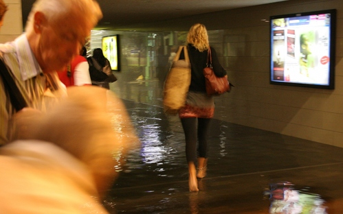
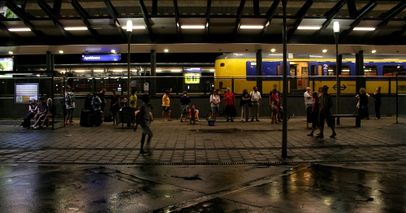

C'est un aventure somme toute banale qui m'est arrivée le 10 juillet dernier mais c'est aussi l'occasion rêvé pour vous parler de **la société néerlandaise des chemins de fer** (en Néerlandais on dit *[Nederlandse Spoorwegen](/les-nederlandse-spoorwegen)* ce qui est plus court mais plus compliqué).

### Mon aventure du 10 juillet
Le 10 juillet était une belle journée d'été, je suis donc allé en train à Deventer pour l'évènement [Deventer sur échasses](http://www.eventindeventer.nl/deventeropstelten/index.php). Comme souvent en été les orages se lèvent en fin de journée et il tombe beaucoup d'eau en très peu de temps. Dans le train du retour, les voyageurs "loisir" ont vu les trombes d'eau lécher les vitres des voitures en se disant qu'ils avaient bien de la chance de ne pas se trouver dessous.

Le train s'est ensuite immobilisé et il a fallu attendre longtemps pour savoir pourquoi. (si vous voulez savoir, c'est à cause du mauvais temps, il y a eu un sérieux orage). Les annonces se sont ensuite multipliés sans apporter plus de précisions quand au départ du train ou autre. On sentait bien que le conducteur n'avais pas plus d'information. Plus d'une heure plus tard, le train est reparti dans l'autre sens pour revenir à Apeldoorn. La rame était prévue pour faire le trajet retour et nous avons du descendre du train On nous a ensuite fait monter dans un autre train, celui de l'heure d'après pour la même route. Les rames étaient bondées mais nous y avons quand même attendu des lustres jusqu'à ce qu'on nous annonce qu'il ne partirait pas. On ne sait toujours pas pourquoi. Pendant ce temps là des gens postent sur Facebook qu'il y a un gros orage près d'Utrecht, c'est sur notre route, il y a peut être des dégâts là bas mais le train pourrait encore nous emmener à la station suivante ou il y a plus de correspondances. 

[Le Volkskrant confirme](http://www.volkskrant.nl/vk/nl/2664/Nieuws/article/detail/1010255/2010/07/10/Veel-overlast-door-noodweer.dhtml) que le problème est entre Utrecht et Amersfoort. Notre train aurait donc pu aller à Amersfoort ou je sais qu'il y a une ligne pour Amsterdam qui ne passe pas par Utrecht. Il est probable que les logisticiens médiocres n'ai pas trouvé de rame ou de chauffeur pour assurer cette liaison. Il est possible aussi que d'autres problèmes ait affecté le tronçon ou la rame que j'aurais aimé prendre. 

Toujours est-il qu'on nous a demandé à tous de sortir de ce deuxième train et de la gare (qui était fermée) et pour ce faire nous avons du patauger dans les trop pleins d'égouts qui avaient envahi les couloirs souterrains de la gare. Ceci pour nous prouver que la NS n'est pas la cause de *tous* nos déboires.

{.center}

Ce samedi soir là, les responsables des NS ont dépêché deux employés et deux bus pour prendre en charge l'ensemble des passagers d'une rame d'*intercity* bondée. A minuit passé et c'est vrai qu'il n'y a pas grand monde de disponible. Les NS ont des accords avec les compagnies de transport locales pour remplacer les trains annulés par des bus mais il semblerait que ces accords n'obligent pas vraiment les compagnies de bus à assurer le service voulu. Dans pareilles conditions, c'est du chacun pour soi, la cohue pour monter dans les bus avant que l'un des employés n'annonce que seuls les gens se rendant à l'aéroport de Schiphol sont prioritaires. Pas bête, le préjudice d'un avion raté est plus onéreux que celui d'une nuit de merde. Je suis donc descendu du bus. Les employés sur place ont commandé des taxis pour acheminer les passagers restants. Il y a du monde, il faut beaucoup de taxis et il faut beaucoup attendre.... J'attends.

{.center}

Les passagers pour Amsterdam étaient dans le dernier groupe, j'y suis pour rien, c'était organisé comme ça, pas beaucoup de néerlandais dans ce groupe en fait, une expatriée irlandaise et des touristes américains qui venaient  d'Allemagne. On nous raconte que les trains sont bloqués de partout et qu'il est difficile de trouver le moindre bus ou taxi, ils sont tous demandés dans les gares de la région...

Je n'ai rien lu de pareil dans le journal le lendemain. Par contre des taxis, nous en avons vu avec notre petit groupe, des *drivers* avaient prévenu les collègues, il y a des jolies courses à se faire à la gare d'Apeldoorn. Certains sont venus mais comme ils n'étaient pas en contrat avec les NS, il sont repartis à vide. Un gâchis de temps et de ressources qui ne semblaient pas émouvoir nos deux employés. C'est très poliment et calmement qu'ils nous ont expliqué ne rien pouvoir faire de plus que d'attendre avec nous le dernier taxi. Ce dernier est finalement venu, vers 2h, nous ramenant chacun à notre domicile...

J'ai finalement fait le trajet **Deventer - Amsterdam avec 7 heures de retard sur l'horaire prévu**. À aucun moment les NS ne m'a prié de l'en excuser.
