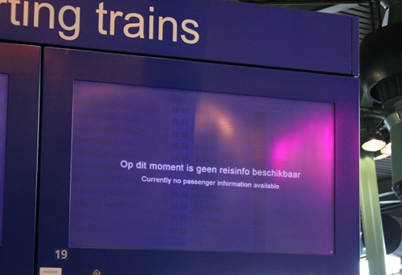

**Les NS** (certains disent **la NS**) est issue de l'ancien monopole d'état de transport ferroviaire. C'est aujourd'hui *une entreprise commerciale* qui ne se charge plus que du *transport des passagers*. Le FRET et les infrastructures ont été séparé de l'entreprise dans les années 90. Son actionnaire principal reste l'État néerlandais. (voir [Nederlandse Spoorwegen](http://fr.wikipedia.org/wiki/Nederlandse_Spoorwegen)).

Ce profil ressemble à beaucoup d'autres compagnies ferroviaires en Europe mais la ressemblance avec la SNCF s'arrête là, on pourrait même dire que La NS et la SNCF s'oppose sur tout le reste. Alors que la SNCF est connu pour son TGV qui bas des records et ses cheminots en grêve. Les *Nederlandse Spoorwegen* mettent plutôt en avant un personnel cordial et serviable et des trains qui ont souvent des problèmes. 

<!--excerpt-->

## Un réseau dense et bien maillé

Les chemins de fers néerlandais reflètent bien la structure non centralisée du pays. Il n'y a pas de centre et chaque ville est un nœud ou l'on peut se rendre vers d'autres villes à partir d'une même gare. Il n'y a pas de ligne de banlieue ou de ligne régionale. Toutes les lignes ont partout le même statut reflétant le coté égalitariste de ce pays. Sur ces lignes, trois type de trains circulent reflètant le coté pragmatique des néerlandais: Les *Intercity* ([NL](http://nl.wikipedia.org/wiki/Intercity)), rapides entre les grandes villes, l'équivalent de nos *Corail*. Les *Sprinter* ([NL](http://nl.wikipedia.org/wiki/Sprinter_%28treinsoort%29)) trains circulant rapidement entre les grandes villes d'un même secteur, l'équivalent de nos *TER*. Les *Stoptrein* ([NL](http://nl.wikipedia.org/wiki/Stoptrein)) s'arrêtant à toutes les gares d'un tronçon entre deux ou trois grandes gares, l'équivalent de nos *omnibus*.

<!-- HTML -->

{.center}
*Un Stoptrein ancien modèle*

<!-- / HTML -->

## Des retards à répétition

Même si cela n'arrive pas tous les jours, les retards et suppressions de train sont monnaie courante. Ce n'est vraisemblablement pas du à la vétusté des rames. Le matériel roulant est moderne et bien entretenu. I semblerait plutôt que la logistique soit le point faible de la compagnie. Les excuses annoncées aux haut-parleurs des gares sont souvent des problèmes de mauvais temps, des rails cassés ou des [feuilles d'automne](/les-marronniers-de-l-automne) sur les voies. Des problèmes courant et souvent prévisibles dont on n'entend peu parler en France, simplement parce que les équipes sont disponibles et efficaces, chose qui semble ne pas être le cas aux Pays-Bas.

<!-- HTML -->

{.center}
*Information : pas d'information*

<!-- / HTML -->

## Des remboursements hypothétiques

Comme la SNCF, les NS ont une politique de remboursement des billets en cas de retard de plus d'une heure. Hélas, la compagnie néerlandaise a pris l'habitude de ne rembourser si le retard d'un train est du à une cause extérieure (mauvaises conditions météorologiques, objets sur les voies...). Les gens semble accepter ce comportement. De temps en temps, si les désagréments sont répétés et concernent beaucoup de monde. La compagnie fait alors un geste commercial et rembourse le billet «alors qu'elle n'y est pas tenue», comme cela m'est arrivé [en décembre 2009](/thalys-comparatif-des-services-clients).
