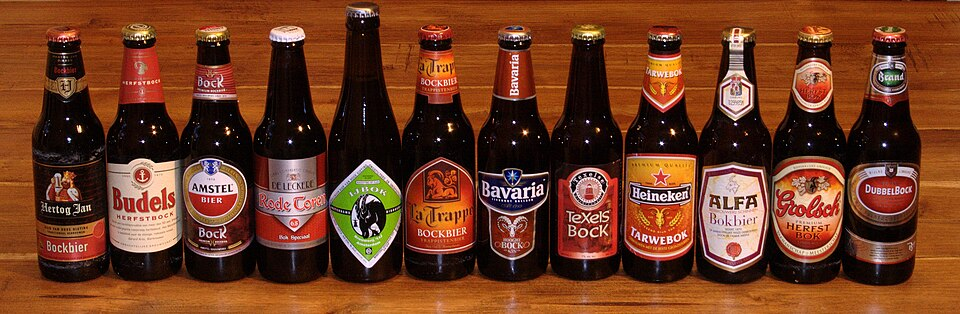

Je vous ai déjà parlé de ces produits saisonniers que sont les *Herfst bokbieren* ou [bières d'automne](/la-herfst-bokbier-biere-d-automne). Je vous ai aussi souligné qu'elles étaient de retour dans mon article [en vrac d'automne](/en-vrac-et-en-automne). Mais voilà, j'aime bien cette bière au goût sucré et je m'en suis fait une petite provision. J'en ai proffité pour faire une jolie photo de genre que l'on retrouve maintenant [sur Wikipedia](/les-nouvelles-bieres-d-automne)

[{.center}](http://commons.wikimedia.org/wiki/File:Bock-bieren-van-Nederland-2010.jpg)

<!--excerpt-->

Le titre de la photo *Bock bieren van Nederland 2010* signifie **les bières d'automne des Pays-Bas 2010** Si l'on compare avec [ma photo précédente](http://commons.wikimedia.org/wiki/File:Bock-bieren-van-Nederland.jpg) datant de 2008 on peut voir que l'on y retrouve les bouteilles de **La Trappe** ou d'**Heineken** mais on voit de gros changement d'étiquettes comme sur la bouteille de **Bavaria**.

Toutes les étiquettes de bockbier portent les couleurs de l'automne à l'exception de la plus grande bouteille, la **IJbok** qui utilise la même étiquette pour sa [bockbier de printemps](/printemps-en-vrac-et-en-retard) et sa bockbier d'automne.

Voici maintenant la légende de cette photo avec la liste des brasseries:

**Hertog Jan Bockbier**  
Une des grandes brasserie néerlandaise, basée à Arcen (Limbourg), elle appartient au groupe InBev.

**Bundels Herfstbock**  
Grosse brasserie familiale brabançonne. 

**Amstel Bock**  
Première grande bockbier commerciale du groupe Heineken.

**De Leckere Rode Toren Bock Speciaal**  
Cette brasserie spéciale est ratachée au café *De Leckere* à Utrecht. Elle produit quelques bières spéciales dont cette bock

**Brouwerij 'tIJ IJbok**  
La plus connue des microbrasseries d'Amsterdam: [IJ](/nouveau-mot-ij) produit la IJbok 

**La Trappe Bockbier**  
Unique brasserie trappiste des Pays-Bas basé à Tilbourg. Les moines, avec l'aide de Bavaria, suivent les tendences marketing du moment et proposent donc une bockbier au catalogue.

**Bavaria Hooghe Bock**  
La deuxième grande brasserie industrielle des Pays-Bas ne pouvait pas ne pas produire de bock.

**Texels Bock**  
Texels est une microbrasserie implantée sur l'île de Texel au nord de la Hollande Septentrionale. Elle commence à avoir du succès au sud de la province, nottement à Amsterdam.

**Heineken Tarwebok**  
La plus grande marque du pays joue l'originalité en appelant sa bière *tarwe*bok ce qui signifie blé-chèvre. Rien de bien original au gout en fait. 

**Alfa Bokbier**  
Brasserie limbourgeoise connue dans sa province.

**Grolsch Herfst Bok**  
Troisième grande brasserie industrielle nationale basée en [Gueldre](/les-provinces-des-pays-bas).

**Brand Dubbel Bock**  
Autre grande marque nationale et autre brasserie du Limbourg, c'est la brasserie la plus ancienne des Pays-Bas.

voir aussi [Les brasseries Néerlandaises](/les-brasseries-neerlandaises)
