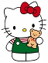
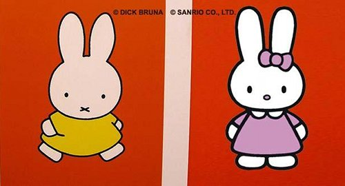

{.left}
On [ne présente plus](/les-nijntje-de-bruna) **Miffy**, alias *Nijntje* en néerlandais son pays d'origine. La petite lapine blanche née en 1955 sous le crayon de Dick Bruna est devenu un personnage familier des petits enfants aux Pays-Bas et ailleurs. Apparemment, elle a plus de succès aux Etats-Unis et au Japon  qu'en Europe.

{.right}
On ne présente plus non plus **Hello Kitty**, la petite chatte japonaise des studios Sanrio est un succès mondial de produits dérivés en tout genre. Hello Kitty a le même nom dans le monde entier (??????) et ne s'adresse pas uniquement aux petits enfants. Les geekettes du monde entier craquent pour les accessoires à effigie de la petite chatte.

Sanrio vient de créer une petite lapine, compagnonne de Hello Kitty. Elle s'appelle **Kathy** et ressemble fortement à notre Miffy nationale. Dick Bruna, qui a aujourd'hui 83 ans et qui veille encore sur les droits de sa création est furieux. Il n'aimait déjà pas la firme japonaise qui en imposait plus que lui avec un personnage similaire ([lire interview en anglais](http://www.telegraph.co.uk/culture/donotmigrate/3557810/Dick-Bruna-creator-of-the-Miffy-books-talks-about-his-life-and-work.html)) mais cette fois le personnage est identique.

Le père de Miffy (*Nijntje*) a donc attaqué la société japonaise. Il considère que le personnage de Kathy viole ses droits de propriété intellectuelle et lui porte préjudice financier. Il a déjà demandé à Sanrio d'arrêter le marketing autour de son personnage mais la société à ignoré la demande. Le Telegraaf, affichant les deux personnages sur sa couverture a annoncé le 19 octobre dernier qu'une cour d'Amsterdam avait été saisie du dossier. Dick Bruna réclame 50.000 euros par jour de retard à satisfaire sa demande.

{.center}

D'autres comme Eith en appellent juste a [abandonner la chatte rose bonbon](http://riennevaplus.canalblog.com/archives/2010/02/17/16938907.html). Verdict dans deux semaines...
---
<!-- post notes:
http://www.homejapan.com/miffy-vs-hello-kitty 
http://news.rti.org.tw/index_newsContent.aspx?id=2&id2=2&nid=264354 
http://www.rnw.nl/english/article/miffy-battles-kathy-dutch-court 
http://cdn.radionetherlands.nl/data/files/imagecache/must_carry/images/lead/teaser-nijntje_2.jpg
--->
