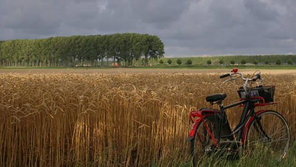
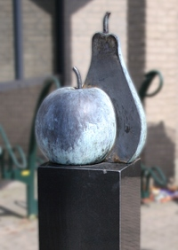
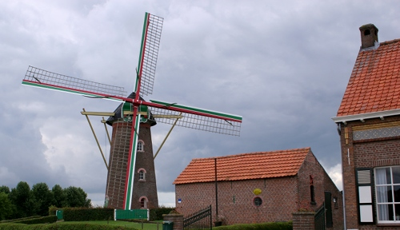

[{.left}|/public/images/scans/cartes/carte-tour-zelande.jpg||Tour de Zélande]Le week end d'août Je suis retourné en Zélande pour voir si Drooderfiets, mon nouveau vélo, apprécieraient le paysage. La dernière fois que j'y suis allé, en 2008, j'avais effectué le trajet en voiture et m'était promené le long de la frontière avec des amis. Cet été j'ai fait le voyage en train, prévoyant de faire [une petite boucle](/voyage-en-zelande-traverser-l-escaut) à vélo dans cette province maritime du sud.

### Une petite boucle

[{.center}|/public/images/scans/cartes/carte-tour-zelande.jpg||Tour de Zélande]

Comme vous pouvez le voir sur la carte ci-dessus (que Drooderfiets a posté [sur sa page facebook](http://www.facebook.com/photo.php?fbid=1248303986569&set=a.1229858125434.27441.1798535697)), j'ai fait quelques kilomètres en Zélande. 109 en tout. Les premières heures, je n'avançais pas très vit parce que je m'arrêtais souvent pour prendre des photos. Le temps passant, je me suis rendu compte que je prenais du retard, il a fallut activer. Je suis arrivé à temps pour le premier (et seul) ferry m'emmenant au sud, en **Flandre zélandaise** (*Zeeuws-Vlaanderen*), pour le ferry du retour, j'ai raté l'horaire que je visais, j'ai du attendre le suivant 40 minutes et je suis rentré directement en train parce qu'il se faisait tard et que c'était **le dernier train pour Amsterdam**.

### Zélande, terre de mer, terre de vent

Le choix de mon parcours s'est fait en fonction des horaires de [ferry pour traverser l'Escaut](/voyage-en-zelande-traverser-l-escaut). Ce faisant, j'ai traversé la province d'est en ouest. C'est un mauvais choix, les vents dominants soufflant depuis la mer du Nord, j'avais le vent de face pour presque toute la durée du trajet. Zélande se dit *Zeeland* en néerlandais ce qui signifié **terre de mer**. On aurait aussi pu l'appeler *Windland*, **terre du vent**. La Zélande est aussi une terre de polders, elle est quadrillée de digues plantées de peupliers. Ces derniers s'agitent mais n'arrêtent pas le vent. Où que l'on se trouve en Zélande on se prend des rafales de vent comparable en force à celles du littoral. Seules quelques pistes planquées au pied d'une digue offraient un court moment de calme.

{.center}

### Le grenier des Pays-Bas.

{.right}
Au début de mon trajet, J'ai visité la région entre [Goes](http://fr.wikipedia.org/wiki/Goes) et [Kapelle](http://fr.wikipedia.org/wiki/Kapelle). Les champs sont visiblement plein de promesses au mois d'août. Nombreuses sont les fermes qui préparent les récoltes de patates. J'ai traversé de nombreux champs de pommes de terre et je me suis rappelé que c'est un **aliment de base de la cuisine néerlandaise**. Les patates que les néerlandais apportent en France pour leurs vacances, ne viennent pas de Hollande mais bien de Zélande... En me rapprochant de **Kapelle**, j'ai aussi vu de grandes étendues de vergers. Certains étaient même entourés de grillages jusque par dessus. Le vent chassant les nuages doivt offrir assez de soleil pour bien faire murir les fruits. Un monument dans le village de Kapelle rappelle comment ces cultures étaient importantes pour l'économie locale On est bien ici dans le garde-manger des Pays-Bas.

Après avoir [franchit l'Escaut|/voyage-en-zelande-traverser-l-escaut||ma traversée], les paysages sont devenus plus classiques avec de grandes étendues de pâtures et surtout des champs de cultures céréalières. Il y a vraiment plus de blé en Zélande qu'en Hollande. C'est peut-être une question de climat, peut-être simplement que tout le monde ne peut pas uniquement cultiver des [fleurs](/tag/fleurs)...

### Déjeuner à Hulst

J'ai fait ma pause déjeuner en début de parcours dans le centre d'une commune entre Anvers et l'Escaut. Les touristes qui venaient nombreux des autres provinces du pays m'ont incité à visiter ce village fortifié. Cette ville me donnait une impression de Flandre que je n'ai pas eu hors de Belgique. Les touristes qui venaient nombreux des autres provinces du pays renforçaient cet impression. Il y a aussi quelques nuances architecturales qui rendent cette province néerlandaise un peu différente du reste des Pays-Bas. Par exemple, les moulins ne sont pas en chaume et octogonaux, ils sont circulaires et en briques. Ils sont par contre tout aussi fréquents que dans le reste du pays.

{.center}

### Escapade en Belgique

Quand on regarde la carte ci dessus, on voit que ma halte à **Hulst** ne s'est faite que dans le premier quart de mon périple. Il me fallait pédaler vite si je voulais attraper le ferry du retour. Ce qui n'était pas facile avec ce vent...

Je suis passé en Belgique en passant par [Sas van Gent](http://fr.wikipedia.org/wiki/Sas_van_Gent), tout près de là ou j'avais visité la Zélande l'année d'avant. J'ai retrouvé les mêmes différences des deux cotés de la frontière et me suis souvenu des raison de [l'indépendance de la Belgique](/voyage-en-zelande-l-independance-de-la-belgique). C'est à [Boekhoute](http://fr.wikipedia.org/wiki/Boekhoute) que j'ai décidé de m'arrêter pour prendre un bonne bière belge.

### Breskens fête ses 500 ans

À la fin de ma course de 109 km, je commençais à être fatigué mais il fallait activer le rythme pour pouvoir prendre le deuxième ferry de 19h25 à **Breskens**. Heu le trajet est plus long que prévu, peut-être celui de 20h25. J'aimerais bien faire aussi un tour de vélo à **Flessingue** (*Vlissingen*), la ville de l'autre rive. Je suis bien arrivé à Breskens juste à temps pour chopper le ferry de 20h25. Hélas, celui-ci est à la sortie de la ville et c'est la cohue dans la ville avec une fête foraine (*[kermis](/kermesse-kermis)*) le long du port. Plein de bateaux dans le port avec des drapeaux de toutes les couleurs. En fait la ville de [Breskens](http://www.breskens.nl/welkom/), station estivale pour allemands et néerlandais en manque de mer [fête ses 500 ans](http://www.500jaarbresjes.nl/index.php?option=com_content&task=view&id=12&Itemid=26). Cela peut paraitre jeune pour une ville européenne mais dans une région de polders, c'est plutôt pas mal.

{.center}

La date retenue pour cet anniversaire est celle de la fondation de la première église sur un polder au bord de l'Escaut commencé sous [Maximilien Ier du Saint-Empire](http://fr.wikipedia.org/wiki/Maximilien_Ier_du_Saint-Empire). L'église a été édifiée peu après la révolte des flamands contre Maximilien Ier, en 1510. Ce n'est qu'en 1517 quand les polders autour sont bien asséchés que la construction du village commence à proprement parler. Nul doute que la ville fêtera à nouveau ses 500 ans en 2017.

Après avoir pris le ferry de 21h25, je suis arrivé juste à temps à Flessingue pour prendre le dernier train pour Amsterdam. Ce fut un long et fatigant voyage mais plein de découvertes.

<!-- HTML -->

<a href="/plein-de-velos-hollandais" title="tout savoir sur la bicyclette aux Pays-Bas">
<!-- / HTML -->
**Plein de vélos hollandais**  
{.center}  
1) Les avantages  
<!-- HTML -->
</a>

<!-- / HTML -->

<!-- HTML -->

<a href="/plein-de-velos" title="tout savoir sur la bicyclette aux Pays-Bas">
<!-- / HTML -->
**Plein de vélos hollandais**  
{.center}  
2) Les styles
<!-- HTML -->
</a>

<!-- / HTML -->

<!-- HTML -->

<a href="/plein-de-velos-hollandais-3" title="tout savoir sur la bicyclette aux Pays-Bas">
<!-- / HTML -->
**Plein de vélos hollandais**  
{.center}  
3) Les marques
<!-- HTML -->
</a>

<!-- / HTML -->

<!-- HTML -->

<a href="/plein-de-velos-pas-hollandais-4" title="tout savoir sur la bicyclette aux Pays-Bas">
<!-- / HTML -->
**Plein de vélos hollandais**  
{.center}  
4) Les marques étrangères
<!-- HTML -->
</a>

<!-- / HTML -->

<!-- HTML -->

<a href="/une-heure-sans-velo" title="tout savoir sur la bicyclette aux Pays-Bas">
<!-- / HTML -->
**Plein de vélos hollandais**  
{.center}  
5) Parking à vélos
<!-- HTML -->
</a>

<!-- / HTML -->

<!-- HTML -->

<a href="/les-velos-de-location" title="tout savoir sur la bicyclette aux Pays-Bas">
<!-- / HTML -->
**Plein de vélos hollandais**  
{.center}  
6) Vélos de location
<!-- HTML -->
</a>

<!-- / HTML -->

<!-- HTML -->

<!-- / HTML -->
---