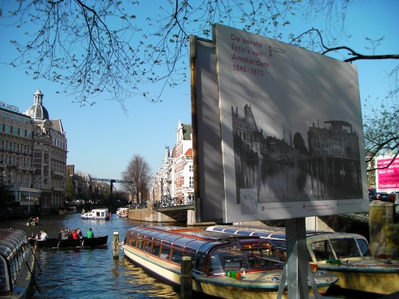

Voilà longtemps que je n'ai pas parlé des expos de photos en plein air. Cette fois je ne vais pas vous inciter à découvrir cet expo, les installations ont été retirées en septembre. Vous l'avez ratée. Cette expo était suffisamment spéciale pour en rendre compte, même des mois après.

L'exposition s'appelait **les premières photos d'Amsterdam 1845 - 1875** (''de eerste foto's van Amsterdam 1845 - 1875'')[^1]. Vu les dates, il est fort probable que ces photos soient vraiment les premières, elles ont été collectées par le les [archives municipales d'Amsterdam](http://stadsarchief.amsterdam.nl/).

Cette exposition est sortie des murs des archives pour aller dans la rue. De grands panneaux montraient ces photos noir et blanc à proximité de là ou elles ont été prises. Une vision d'Amsterdam d'hier et d'aujourd'hui d'un seul regard.

{.center}

Elles sont l'?uvre de **Benjamin Brecknell Turner**, un fabricant anglais de bougies qui se trouve être connu aujourd'hui pour ces photos de paysages. En 1857, il a passé deux semaines à Amsterdam. Il a pris de nombreuses photos qui sont aujourd'hui un témoignage du passé.

Peut-être qu'un jour ce blog entrera aussi dans les archives municipales de la ville.

---
[^1]: Notez que j'ai pris la peine de traduire les dates...
<!-- post notes:
aussi:
http://www.sepiatown.com/810175-Palace-of-the-People-Paleis-voor-Volksvlijt-Amsterdam-The-Netherlands
--->
